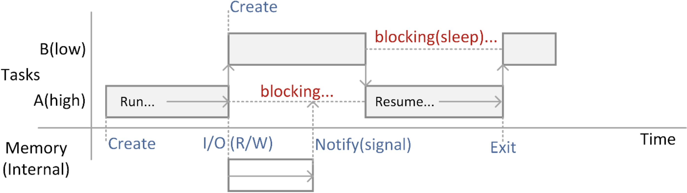
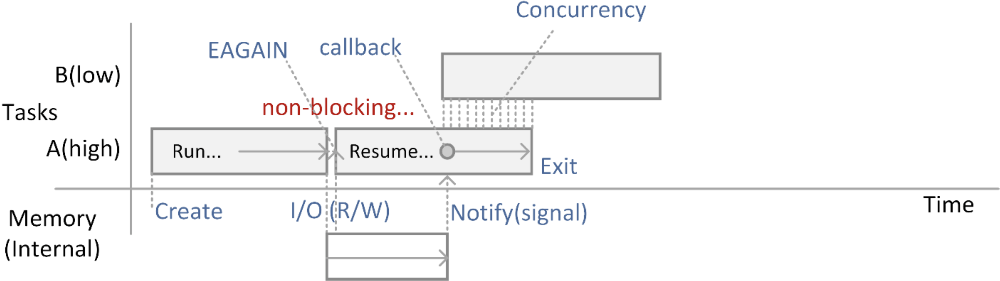
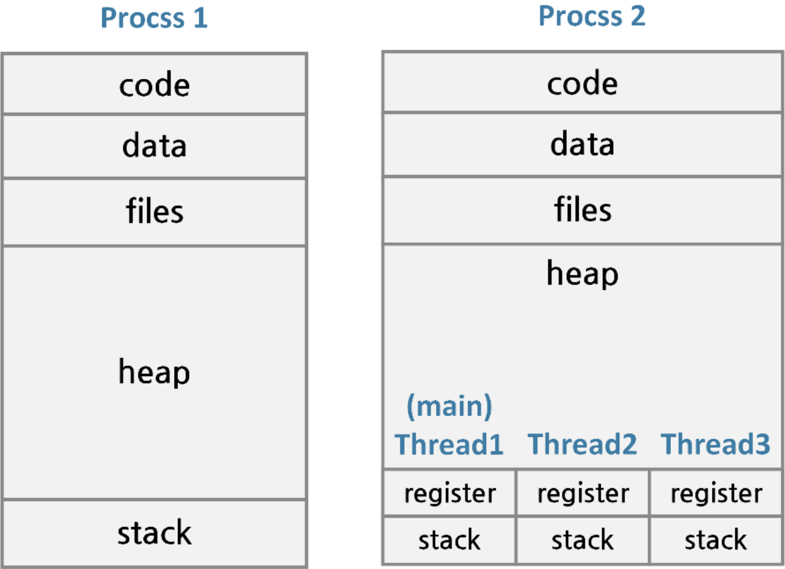
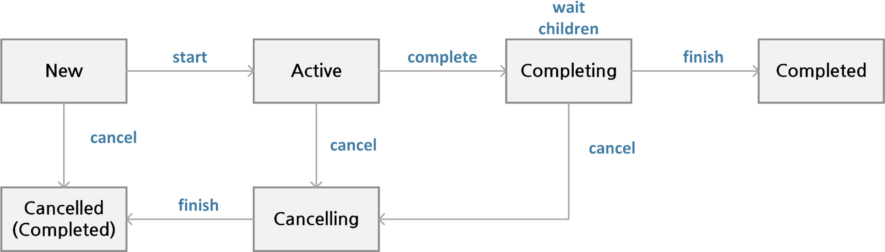

# 코루틴과 동시성 프로그래밍

## 동시성 프로그래밍

- 동기적(Synchronous) 수행
    - 순서대로 작업을 수행하여 하나의 루틴을 완료한 후 다른 루틴을 실행하는 방식
    - 다양한 기능이 한꺼번에 일어나는 다중 실행 환경에서는 성능상의 제약 발생
        - UI, 데이터 다운로드를 동시에 대응해야 하는 경우
- 비동기적(Asynchronous) 수행
    - 다양한 기능을 동시에 수행할 수 있는 방식
    - 전통적인 스레드를 이용하거나 RxJava, Reactive 와 같은 서드파티 라이브러리에서 제공
    - Kotlin 에서는 Coroutines 를 기본으로 제공

- Coroutines
    - 먼저 하나의 개별적인 작업을 루틴(routine)이라고 부르는데 여러 개의 루틴들이 협력(co)한다는 의미로 만들어진 합성어
    - Kotlin 의 Coroutines 를 사용하면 Non-blocking 또는 비동기 코드를 마치 일반적인 동기 코드처럼 쉽게 작성하면서도 비동기 효과를 낼 수 있음

### 동시성 프로그래밍 용어 정리

- Blocking 동작



- Non-blocking 동작



### 프로세스와 스레드

- Task 개념
    - 보통 Task 는 큰 실행 단위인 프로세스나 좀 더 작은 실행 단위인 스레드로 생각할 수 있음
    - 프로세스는 실행되는 메모리, 스택, 열린 파일 등을 모두 포함하기 때문에 프로세스간 문맥 교환(context-switching)을 하는데 비용이 큼
    - 스레드는 자신의 스택만 독립적으로 가지고 나머지는 대부분 공유하므로 문맥 교환 비용이 낮아 프로그래밍에서 많이 사용
    - 다만 여러 개의 스레드를 구성하면 코드가 복잡

### 문맥교환(Context-Switching)

- 하나의 프로세스나 스레드가 CPU 를 사용하고 있는 상태에서 다른 프로세스나 스레드가 CPU 를 사용하도록 하기 위해, 이전의 프로세스의 상태(문맥)를 보관화고 새로운 프로세스의 상태를 적재하는 과정



- 기본 Thread 생성해 보기

```kotlin
class SimpleThread : Thread() {
    override fun run() {
        println("Current Thread: ${currentThread()}")
    }
}

class SimpleRunnable : Runnable {
    override fun run() {
        println("Current ThreaD: ${Thread.currentThread()}")
    }
}

fun main() {
    val thread = SimpleThread()
    thread.start()

    val runnable = SimpleRunnable()
    val thread1 = Thread(runnable)
    thread1.start()
}
```

### Thread 의 생성

- 익명 객체를 사용하면 클래스의 객체를 만들지 않고도 다음과 같이 실행

```kotlin
object : Thread() {
    override fun run() {
        println("Current Thread(object): ${currentThread()}")
    }
}
```

- Thread Class 를 손쉽게 사용하도록 함수 만들기

```kotlin
public fun thread(
    start: Boolean = true,
    isDaemon: Boolean = false,
    contextClassLoader: ClassLoader? = null,
    name: String? = null,
    priority: Int = -1,
    block: () -> Unit
): Thread {
    val thread = object : Thread() {
        override fun run() {
            block()
        }
    }
    if (isDaemon) {
        thread.isDaemon = true
    }
    if (priority > 0) {
        thread.priority = priority
    }
    if (name != null) {
        thread.name = name
    }
    if (contextClassLoader != null) {
        thread.contextClassLoader = contextClassLoader
    }
    if (start) {
        thread.start()
    }
    return thread
}

fun main() {
    thread(start = true) {
        println("Current Thread(Custom function): ${Thread.currentThread()}")
        println("Priority: ${Thread.currentThread().priority}")
        println("Name: ${Thread.currentThread().name}")
        println("IsDaemon: ${Thread.currentThread().isDaemon}")
    }
}
```

### Thread Pool 사용하기

- `newFixedThreadPool()`
    - 자주 재사용되는 스레드를 이용하기 위해 미리 생성된 스레드풀에서 스레드 이용

```kotlin
import java.util.concurrent.ExecutorService
import java.util.concurrent.Executors

val myService: ExecutorService = Executors.newFixedThreadPool(8)
var i = 0

while (i < items.size) {
    val item = items[i]
    myService.submit {
        processItem(item)
    }
    i++
}
```

## Coroutines 개념과 사용

### Kotlin 의 Coroutines

- 스레드와 달리 Kotlin 은 Coroutines 을 통해 복잡성을 줄이고도 손쉽게 일시 중단하거나 다시 시작하는 루틴을 만들어낼 수 있음
- 멀티테스킹을 실현하면서 가벼운 스레드라고도 불림
- Coroutines 는 문맥교환 없이 해당 routine 을 일시중단을 통해 제어

### Coroutines 의 주요 패키지

- `kotlinx.coroutines`의 common 패키지
    - `launch`, `async`: Coroutines Builder
    - `Job`, `Deferred`: cancellation 지원을 위한 기능
    - `Dispatchers`: Default 는 백그라운드 Coroutines 를 위함, Main 은 Android, Swing, JavaFx 를 위해 사용
    - `delay`, `yield`: 상위 레벨 지연 함수
    - `Channel`, `Mutex`: 통신과 동기화를 위한 기능
    - `coroutineScope`, `supervisorScope`: 범위 빌더
    - `select`: 표현식 지원

- core 패키지
    - `CommonPool`: Coroutines Context
    - `produce`, `actor`: Coroutines Builder

### Coroutines Builder

- `launch`
    - 일단 실행하고 잊어버리는(fire-and-forget) 형태의 Coroutines 로 메인 프로그램과 독립되어 실행 가능
    - 기본적으로 즉시 실행하며 블록 내의 실행 결과는 반환하지 않음
    - 상위 코드를 블록시키지 않고(Non-blocking) 관리를 위한 Job 객체를 즉시 반환
    - `join`을 통해 상위 코드가 종료되지 않고 완료를 기다리게 할 수 있음

- `async`
    - 비동기 호출을 위해 만든 Coroutines 로 결과나 예외를 반환
    - 실행 결과는 `Deffered<T>`를 통해 반환하며 `await`을 통해 받을 수 있음
    - `await`는 작업이 완료될 때까지 기다림

### `launch`와 `async`

- 기본적인 launch Builder 의 사용

```kotlin
import kotlinx.coroutines.GlobalScope

fun main() {
    GlobalScope.launch {
        delay(1000L)
        println("World!")
    }
    println("Hello, ")
    Thread.sleep(2000L)
}
```

- 일시 중단(suspended) 함수
    - `delay()`의 경우 일시 중단될 수 있으며 필요한 경우 재개(resume)

- `delay()`의 선언부
    - `suspend` 함수를 Coroutines 블록 외에 사용하면 오류 발생

```kotlin
public suspend fun delay(timeMillis: kotlin.Long): kotlin.Unit { /* compiled code */
}
```

- 사용자 함수에 `suspend` 적용
    - 컴파일러는 `suspend`가 붙은 함수를 자동적으로 추출해 Continuation Class 로부터 분리된 루틴을 만듬
    - 이러한 함수를 사용하기 위해 Coroutines Builder 인 `launch`와 `async`에서 이용할 수 있음

```kotlin
suspend fun doSomething() {
    println("Do Something!")
}
```

### Job 객체

- Job
    - Coroutines 의 생명주기를 관리하며 생성된 Coroutines 작업들은 부모-자식 같은 관계를 가질 수 있음
- Job 규칙
    - 부모가 취소되거나 실행 실패하면 그 하위 자식들은 모두 취소
    - 자식의 실패는 그 부모에 전달되며 부모 또한 실패
- SupervisorJob
    - 자식의 실패가 그 부모나 다른 자식에 전달되지 않으므로 실행을 유지할 수 있음

### Job 과 명시적 완료 기다리기

- `join()` 결과 기다리기
    - Job 객체의 `join()`을 사용해 완료를 기다릴 수 있음
        - launch 에서 반환 값을 받으면 Job 객체가 되기 때문에 이것을 이용해 main 메소드에서 `join()`을 호출할 수 있음

```kotlin
fun main() = runBlocking<Unit> {
    val job = launch {
        delay(1000L)
        println("World")
    }
    println("Hello")
    job.join() // 명시적으로 코루틴이 완료 대기, 취소할 경우 job.cancel()
}
```

### Job 의 상태



- New
    - isActive: false
    - isCompleted: false
    - isCancelled: false
- Active(Default)
    - isActive: true
    - isCompleted: false
    - isCancelled: false
- Completing
    - isActive: true
    - isCompleted: false
    - isCancelled: false
- Cancelling
    - isActive: false
    - isCompleted: false
    - isCancelled: true
- Cancelled(최종 상태)
    - isActive: false
    - isCompleted: true
    - isCancelled: true
- Completed(최종 상태)
    - isActive: false
    - isCompleted: true
    - isCancelled: false

### Coroutines 의 중단과 취소

- 중단(Coroutines 코드 내에서)
    - `delay(시간값)`: 일정 시간을 지연하며 중단
    - `yield()`: 특정 값을 산출하기 위해 중단
- 취소(Coroutines 외부에서)
    - `Job.cancel()`: 지정된 Coroutines 작업을 즉시 취소
    - `Job.cancelAndJoin()`: 지정된 Coroutines 작업을 취소(완료시까지 대기)

**기본적으로 부모 자식 관계에 적용될 수 있으며 부모 블록이 취소되면 모든 자식 Coroutines 이 취소**

### async Coroutines Builder 생성

- 동시성 처리를 위한 async coroutines
    - `launch` 와 다른 점은 `Deferred<T>` 를 통해 결과값을 반환
    - 지연된 결과 값을 받기 위해 `await()`를 사용

```kotlin
private fun worksInParallel() {
    val one = GlobalScope.async {
        // Do Something
    }
    val two = GlobalScope.async {
        // Do Something
    }

    GlobalScope.launch {
        val combined = "${one.await()}_${two.await()}"
        println("Kotlin Combined: $combined")
    }
}
```

### Coroutine Context

- Coroutine 을 싱행하기 위한 다양한 설정값을 가진 관리 정보
- Dispatcher 는 Coroutine Context 를 보고 어떤 스레드에서 실행되고 있는지 식별이 가능
- Coroutine Context 는 `+` 연산을 통해 조합될 수 있음

```kotlin
val someCoroutineContext = someJob + Dispatchers.IO + someCoroutineName + someExceptionHandler
```

- CoroutineName
    - Coroutine 에 이름을 주며 디버깅을 위해서 사용

```kotlin
val someCoroutineName = CoroutineName("someCoroutineName")
```

- Job
    - 작업 객체를 지정할 수 있으며 취소가능 여부에 따라 `SupervisorJob()` 사용

```kotlin
val parentJob = SupervisorJob()
val someJob = Job(parentJob)
```

- CoroutineDispatcher
    - Dispatchers.Default, ...IO 등을 지정할 수 있으며 필요에 따라 스레드 생성 가능

```kotlin
import java.util.concurrent.Executors

val myPool = Executors.newFixedThreadPool(2).asCoroutineDispatcher()
```

- CoroutineExceptionHandler
    - Coroutine Context 를 위한 예외처리를 담당하며 Coroutine 에서 예외가 던져지면 처리
    - 예외가 발생한 Coroutine 은 상위 Coroutine 에 전달되어 처리될 수 있음
        - Scope 를 가지는 경우 예외 에러를 잡아서 처리할 수 있음
    - 만일 예외처리가 자식에만 있고 부모에 없는 경우 부모에도 예외가 전달되므로 주의 요망
        - 이 경우 앱이 Crash 됨
    - 예외가 다중으로 발생하면 최초 하나만 처리하고 나머지는 무시

```kotlin
import kotlin.coroutines.coroutineContext

val someExceptionHandler = CoroutineExceptionHandler { coroutineContext, throwable ->
    val coroutineName = coroutineContext[CoroutineName]?.name ?: "default coroutine name"
    println("Error in $coroutineName: ${throwable.localizedMessage}")
}
```

### Coroutine 의 Scope

- GlobalScope
    - 독립형(Standalone) Coroutine 구성, 생명주기는 프로그램 전체(top-level)에 해당하는 범위를 가지며 main 의 생명 주기가 끝나면 같이 종료
    - Dispatchers.Unconfined 와 함께 작업이 서로 무관한 전역 범위 실행
    - 보통 GlobalScope 상에서는 launch 나 async 사용이 권장되지 않음
- CoroutineScope
    - 특정 목적의 Dispatcher 를 지정한 범위를 블록으로 구성할 수 있음
    - 모든 Coroutine Builder 는 CoroutineScope 의 인스턴스를 가짐
    - `launch { .. }`와 같이 인자가 없는 경우에는 CoroutineScope 에서 상위의 문맥이 상속되어 결정
    - `launch(Dispatchers.옵션인자) { .. }` 와 같이 Dispatcher 의 Scheduler 지정가능
        - `Dispatchers.Default`는 GlobalScope 에서 실행되는 문맥과 동일하게 사용

#### Coroutine Scope 사용

- GlobalScope

```kotlin
val scope = GlobalScope
scope.launch { }
scope.async
```

```kotlin
GlobalScope.launch { }
val job1 = GlobalScope.launch { } // Job 객체, job.join() 으로 기다림
val job2 = GlobalScope.async { } // Deferred 객체, Deferred.await() 으로 기다림
```

- CoroutineScope

```kotlin
val scope = CoroutineScope(Dispatchers.Default)
val routine1 = scope.launch { }
val routine2 = scope.async { }
```

```kotlin
launch(Dispatchers.Default) { }
async(Dispatchers.Default) { }
```

### Thread Pool

- Thread Pool 의 사용
    - 보통 CommonPool 이 지정되어 Coroutine 이 사용할 스레드의 공동 풀을 사용
    - 이미 초기화되어 있는 스레드 중 하나 혹은 그 이상이 선택되며 초기화하기 때문에 스레드를 생성하는 오버헤드가 없어 빠름
    - 하나의 스레드에 다수의 Coroutine 이 동작할 수 있음
- 특정 스레드 개수를 직접 지정하는 경우

```kotlin
import java.util.concurrent.Executors

val threadPool = Executors.newFixedThreadPool(4)
```

### 부모-자식 및 독립적인 Scope 의 Coroutine

```kotlin
fun main() = runBlocking {
    val request = launch {
        GlobalScope.launch {
            println("Job1: Before suspend Function")
            delay(1000)
            println("Job1: After suspend Function")
        }
        launch {
            delay(100)
            println("Job2: Before suspend Function")
            delay(1000)
            println("Job2: After suspend Function")
        }
    }

    delay(500)
    request.cancel()
    delay(1000)
}
```

### 실행방법의 비교

```kotlin
import kotlin.system.measureTimeMillis

fun work(i: Int) {
    Thread.sleep(1000)
    println("Work $i done")
}

fun main() {
    val time = measureTimeMillis {
        runBlocking {
            for (i in 1..2) {
                launch {
                    work(i)
                }
            }
        }
    }
    println("Done in $time ms")
}
```

- 생성된 두개의 작업은 단일 스레드에서 순차적으로 실행

```kotlin
import kotlin.system.measureTimeMillis

fun work(i: Int) {
    Thread.sleep(1000)
    println("Work $i done")
}

fun main() {
    val time = measureTimeMillis {
        runBlocking {
            for (i in 1..2) {
                launch(Dispatchers.Default) {
                    work(i)
                }
            }
        }
    }
    println("Done in $time ms")
}
```

- 생성된 두개의 작업은 동시성을 제공하여 분리된 작업으로 실행

```kotlin
import kotlin.system.measureTimeMillis

fun work(i: Int) {
    Thread.sleep(1000)
    println("Work $i done")
}

fun main() {
    val time = measureTimeMillis {
        runBlocking {
            for (i in 1..2) {
                GlobalScope.launch {
                    work(i)
                }
            }
        }
    }
    println("Done in $time ms")
}
```

- 부모와 무관환 독립 실행이므로 작업완료를 기다리지 않음

### Builder 의 특정 속성 지정

- 시작 시점에 대한 속성

```kotlin
public fun launch(
    context: CoroutineContext,
    start: CoroutineStart,
    parent: Job?,
    onCompletion: CompletionHandler?,
    block: suspend CoroutineScope.() -> Unit
): Job {
    /* ... */
}
```

- CoroutineStart
    - DEFAULT: 즉시 시작(해당 문맥에 따라 즉시 스케쥴링)
    - LAZY: Coroutine 을 느리게 시작(처음에는 중단된 상태이며 `start()`나 `await()` 등으로 시작)
    - ATOMIC: 원자적으로 즉시 시작(DEFAULT 와 비슷하나 Coroutine 실행전에는 취소)
    - UNDISPATCHED: 현재 스레드에서 즉시 시작(첫 지연함수까지, 이후 재개시 다시 시작됨)

- `start()` 혹은 `await()` 이 호출될 떄 실제로 시작
    - `launch`나 `async`는 즉시 실행되지만 `start` 옵션에 다라 실행시점을 늦출 수 있음

```kotlin
val job = async(start = CoroutineStart.LAZY) { doWork1() }
job.start()
```

### 완료를 기다리기 위한 Blocking

- `runBlocking`의 사요
    - 새로운 Coroutine 을 실행하고 완료되기 전까지는 현재 스레드를 Blocking
    - Coroutine Builder 와 마찬가지로 CoroutineScope 의 인스턴스를 가짐

```kotlin
fun <T> runBlocking(
    context: CoroutineContext = EmptyCoroutineContext,
    block: suspend CoroutineScope.() -> T
): T {
}
```

- `main()` 을 Blocking 모드로 동작시키기

```kotlin
fun main() = runBlocking {
    launch {
        delay(1000L)
        println("World!")
    }
    println("Hello")
}
```

### runBlocking 의 사용

- `runBlocking()`을 클래스 내의 멤버 메소드에서 사용할 때

```kotlin
class MyTest {
    fun mySuspendMethod() = runBlocking {
        // Do Something
    }
}
```

- 특정 Dispatcher Option 을 주어줄 때

```kotlin
runBlocking(Dispatchers.IO) {
    launch {
        repeat(5) {
            println("counting ${it + 1}")
            delay(1000)
        }
    }
}
```

### 특정 문맥과 함께 실행

- `withContext()`
    - 인자로 Coroutine 문맥을 지정하며 해당 문맥에 따라 코드 블록을 실행
    - 해당 코드 블록은 다른 스레드에서 수행되며 결과를 반환
    - 부모 스레드는 블록하지 않음

```kotlin
suspend fun <T> withContext(context: CoroutineContext, block: suspend CoroutineScope.() -> T): T {}
```

```kotlin
result = withContext(Dispatchers.IO) { function() }
```

### 또 다른 사용 예

- 완료보장
    - `withContext(NonCancellable) { ... }`
        - `try { ... } finally { ... }`에서 finally 블록의 실행을 보장하기 위해 취소불가 블록 구성

### Scope Builder

- coroutineScope Builder
    - 자신만의 Coroutine Scope 를 선언하고 생성할 수 있음
    - 모든 자식이 완료되기 전까지는 생성된 Coroutine Scope 는 종료되지 않음
    - runBlocking 과 유사하지만 runBlocking 은 단순 함수로 현재 스레드를 Blocking
    - coroutineScope 는 단순히 suspend 함수 현태로 Non-Blocking 으로 사용
    - 만일 자식 Coroutine 이 실패하면 이 Scope 도 실패하고 남은 모든 자식은 취소됨(supervisorScope 는 실패하지 않음)
        - 외부에 의해 작업이 취소되는 경우 CancellationException 발생

```kotlin
suspend fun <R> coroutineScope(block: suspend CoroutineScope.() -> R): R {}
```

- supervisorScope Builder
    - 마찬가지로 Coroutine Scope 를 생성하며 이때 SupervisorJob 과 함께 생성하여 기존 문맥의 Job 을 오버라이드
        - launch 를 사용해 생성한 작업의 실패는 CoroutineExceptionHandler 를 통해 핸들링
        - async 를 사용해 생성한 작업의 실패는 Deferred.await 의 결과에 따라 핸들링
        - parent 를 통해 부모작업이 지정되면 자식작업이 되며 이 때 부모에 따라 취소여부 결정
    - 자식이 실패하더라도 이 Scope 는 영향을 받지 않으므로 실패하지 않음
        - 실패를 핸들링하는 정책을 구현할 수 있음
    - 예외나 의도적인 취소에 의해 이 Scope 의 자식들을 취소하지만 부모의 작업은 취소하지 않음

- coroutineScope Builder 의 예

```kotlin
fun main() = runBlocking {
    launch {
        delay(200L)
        println("Task from runBlocking")
    }

    coroutineScope {
        launch {
            delay(500L)
            println("Task from nested launch")
        }

        delay(100L)
        println("Task from coroutine scope")
    }
    println("Coroutine Scope is over")
}
```

### 부모와 자식 Coroutine 과의 관계

- 병렬 분해(Parallel Decomposition)

```kotlin
suspend fun loadAndCombine(name1: String, name2: String): Image {
    val deferred1 = async { loadImage(name1) }
    val deferred2 = async { loadImage(name2) }
    return combineImages(deferred1.await(), deferred2.await())
} // 네트워크 문제 등으로 deferred1 작업이 취소 되더라도 deferred2 작업은 계속 진행
```

- Coroutine Context 에서 실행하여 자식 Coroutine 으로 구성한다면 예외를 부모에 전달하고 모든 자식 Coroutine 을 취소할 수 있음

```kotlin
suspend fun loadAndCombine(name1: String, name2: String): Image = coroutineScope {
    val deferred1 = async { loadImage(name1) }
    val deferred2 = async { loadImage(name2) }
    return combineImages(deferred1.await(), deferred2.await())
}
```

### Scope 취소와 예외처리

```kotlin
val scope = CoroutineScope
val routine1 = scope.launch {
    // Do Something
}
val routine2 = scope.async {
    // Do Something
}

scope.cancel() // or
scope.canelChildren()

// CancellationException 을 catch 하여 예외 처리 한다
```

### Coroutine 의 실행 시간 지정

- 실행 시간 제한
    - `withTimeout(value) { ... }`: 특정 시간값 동안만 수행하고 블록을 끝냄
        - 시간값이 되면 TimeoutCancellationException 발생
    - `withTimeoutOrNull(value) { ... }`: 동작은 위와 동일
        - 단, 예외를 발생하지 않고 null 을 반환

```kotlin
val result = withTimeoutOrNull(1300L) {
    repeat(1000) { i ->
        println("I'm sleeping $i ...")
        delay(500L)
    }
    "Done"
}
println("Result is $result")
```

## Coroutine 의 동작제어

### Coroutine 의 문맥

- Coroutine 은 항상 특정 문맥에서 실행
    - 어떤 문맥으로 실행되어야 할지 Dispatcher 가 결정
    - Dispatcher 는 일종의 Coroutine Scheduler 로 여러가지 특정 스레드를 지정할 수 있음

- 기본 문맥: `Dispatchers.Default(DefaultScheduler)`
    - 정해진 Coroutine 문맥이 없으면 기본으로 선택
    - Dispatchers.Default 는 CommonPool 에서 실행되고 GlobalScope 로도 표현
    - 다음 두 표현은 같은 표현
        - `launch(Dispathcers.Default) { ... }`: 자동으로 상위 Coroutine 블록에서 완료를 기다림
        - `GlobalScope.launch { ... }`: Job 에서 제어를 직접 지정
    - 공유된 백그라운드 스레드의 공통 풀에서 Coroutine 을 실행
        - 스레드를 새로 생성하지 않고 기존에 있는 것을 이용
    - CPU 를 사용하는 연산 중심의 코드에 적합
- I/O 를 위한 문맥: `Dispathcers.IO`
    - Dispatchers.IO 는 입출력 위주의 동작을 하는 코드에 적합한 공유된 풀
    - 블로킹 동작이 많은 파일이나 Socket I/O 처리에 사용하면 용이
- Unconfined 문맥: `Dispatchers.Unconfined`(사용하지 않는 것을 권장)
    - 호출자 스레드에서 Coroutine 을 시작하지만 첫 번째 지연점까지만 실행
    - 특정 스레드나 풀에 Coroutine 을 가두지 않고 첫 번째 일시중단 후 호출된 지연 함수에 의해 재개
    - CPU 를 소비하거나 UI 를 갱신하는 Coroutine 이 아닌 경우에 적합
- UI 문맥: `Dispatchers.Main`
    - 안드로이드 코드 구성 시 UI 를 제어할 수 있는 메인 스레드 문맥에서 실행
    - `kotlinx-coroutines-android`를 import 하는 경우 사용 가능
    - 핸들러의 전달 없이 즉시 UI 를 갱신하려면 `Dispatchers.Main.immediate` 사용
- 새 스레드를 생성하는 문맥
    - `newSingleThreadContext`는 사용자가 직접 새 스레드 풀 생성 가능
    - 새 스레드를 만들기 때문에 비용이 많이 들고 더 이상 필요하지 않으면 해제하거나 종료시켜야 함

### 지연함수 이전과 이후에 변경되는 문맥

```kotlin
fun main() = runBlocking {
    launch(Dispathcers.Unconfined) {
        println("Unconfined: I'm working in thread ${Thread.currentThread().name}")
        delay(500)
        println("Unconfined: After delay in thread ${Thread.currentThread().name}")
    }
    launch {
        println("main runBlocking: I'm working in thread ${Thread.currentThread().name}")
        delay(1000)
        println("main runBlocking: After delay in thread ${Thread.currentThread().name}")
    }
}
```

### repeat 를 사용한 반복 동작하기

- 여러번 반복시키기

```kotlin
fun main() = runBlocking {
    GlobalScope.launch {
        repeat(1000) { i ->
            println("I'm sleeping $i ...")
            delay(500)
        }
    }
    delay(1300)
}
```

- GlobalScope 로 생명 주기를 한정했기 때문에 main 스레드가 종료되어 버리면 더 이상 진행되지 않음

### 하위의 모든 Coroutine 자식을 기다리기

- join 을 사용

```kotlin
fun main() = runBlocking {
    val request = launch {
        repeat(3) { i ->
            launch {
                delay((i + 1) * 200)
                println("Coroutine $i is done")
            }
        }
        println("request: I'm done and I don't explicitly join my children that are still alive")
    }
    request.join()
    println("Now processing of the request is complete")
}
```

### Coroutine 생명주기 제어

- 문맥과 함께 CoroutineScope 사용
    - `CoroutineScope(Coroutine Context + [Job 또은 SupervisorJob])`

- SupervisorJob 의 예

```kotlin
fun main() = runBlocking {
    val handler = CoroutineExceptionHandler { _, exception ->
        println("Caught $exception")
    }

    val supervisor = SupervisorJob()
    with(CoroutineScope(coroutineContext + supervisor)) {
        val first = launch(handler) {
            println("First Child is failing")
            throw AssertionError("First Child is cancelled")
        }
        val second = launch {
            first.join()
            println("firstChild.isCancelled: ${first.isCancelled}, but second one is still active")
            try {
                delay(Long.MAX_VALUE)
            } finally {
                println("Second child is cancelled because supervisor is cancelled")
            }
        }
        first.join()
        println("Cancelling Supervisor")
        supervisor.cancel()
        second.join()
    }
}
```

### 스레드-지역 데이터

- Coroutine 간의 데이터를 전달하는 기본적인 방법
    - ThreadLocal 의 asContextElement 확장함수를 사용해 각 Coroutine 에서 사용

```kotlin
val threadLocal = ThreadLocal<String?>()

fun main() = runBlocking {
    threadLocal.set("main")
    println("Pre-main: thread local value: '${threadLocal.get()}'")

    val job = launch(Dispatchers.Default + threadLocal.asContextElement(value = "launch")) {
        println("Launch start: thread local value: '${threadLocal.get()}'")
        yield()
        println("After yield: thread local value: '${threadLocal.get()}'")
    }
    withContext(Dispatchers.Main) {
        println(threadLocal.get())
        threadLocal.set("UI") // 밖으로 전파되지 않음
    }
    job.join()
    println("Post-main: thread local value: '${threadLocal.get()}'")
}
```

### 채널의 동작

- 개념
    - 채널(Channel) 은 자료를 서로 주고받기 위해 약속된 일종의 통로 역할
    - Coroutine 의 Channel 은 Non-Blocking 전송 개념으로 사용
        - Kotlin 의 Channel 은 `put()`, `take()` 를 사용하는 Java8 의 `BlockingQueue` 와 흡사
- 실제 전송에는 다음과 같이 지연 함수의 `send()`와 `receive()`를 사용
    - `SendChannel`: `suspend fun send(element: E)`
    - `ReceiveChannel`: `suspend fun receive(): E`

- send 와 receive 로 채널 사용해 보기

```kotlin
fun main() = runBlocking {
    val channel = Channel<Int>()
    launch {
        for (x in 1..5) {
            channel.send(x * x)
        }
    }
    repeat(5) {
        println(channel.receive())
    }
    println("Done!")
}
```

- 채널 닫기
    - 보통 for 루프를 구성해 채널을 받게 되고 `close()`를 사용하면 바로 채널을 닫는 것이 아니라 닫겠다는 특수한 토큰을 보냄

```kotlin
fun main() = runBlocking {
    val channel = Channel<Int>()
    launch {
        for (x in 1..5) {
            channel.send(x * x)
        }
        channel.close()
    }
    for (element in channel) {
        println(element)
    }
    println("Done!")
}
```

### 기타 확장된 채널

- `RendezvousChannel`
    - `RendezvousChannel<E>`는 내부에 버퍼를 두지 않는 채널
    - 모든 send 동작은 receive 가 즉각 가져가기 전에는 일시 중단, 반대로 모든 receive 도 누군가 send 하기 전까지는 일시 중단
- `ArrayChannel`
    - 특정 사이즈로 고정된 버퍼를 가진 채널
    - 해당 버퍼가 꽉 차기 전까진 send 가 지연되지 않고 보낼 수 있음
- `LinkedListChannel`
    - 버퍼의 사이즈에 제한이 없어 send 시 일시 중단인 상태를 가지지 않음
    - send 를 지속할 경우 메모리 부족 오류 발생
- `ConflatedChannel`
    - 버퍼는 하나의 요소만 허용

