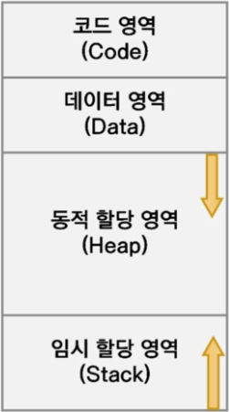

# 1장 - 코틀린 시작하기

## 코틀린 탄생 배경

### 목표

풀스택 웹 개발, Android/iOS 앱, 임베디드, IoT 등 다양한 플랫폼에서 개발할 수 있도록 하는 것

### 특징

- IDE 로 유명한 JetBrains 에서 개발
- 코드가 간결하고 다재 다능하며 호환성이 높음
- 문장 끝에 세미콜론은 옵션
- Android Studio 에서 안드로이드 공식 언어로 추가
- 변수는 Nullable, NotNull 로 나눠짐, 변수 선언 시 `?` 를 붙여 Nullable 로 만들 수 있음

## 다양한 플랫폼

- Kotlin/JVM
- Kotlin/JS
- Kotlin/Native

### Kotlin/Native 에서의 타깃

- iOS
- MacOS
- Android
- Windows
- Linux
- WebAssembly

## Kotlin 의 장점

- 자료형에 대해 오류를 미리 잡을 수 있는 정적 언어
- Null Pointer 로 인한 프로그램의 중단을 예방
    - 개발자들은 이런 특징을 `NPE에서 자유롭다.` 라고 함
- 아주 간결하고 효율적
- 함수혈 프로그래밍과 객체 지향 프로그래밍 모두 가능
- 세미콜론을 생략할 수 있음

## Android 의 공식언어

### Java 와 Android 그리고 Kotlin

- 제임스 고슬링 - Java 의 개발자
- 선 마이크로 시스템즈 -> Oracle 합병 이후 Java 의 부분 유료 정책 고수

### Java 와 Oracle JDK

Java 자체는 무료지만 SDK 인 Oracle JDK 는 특정 기능을 위해 라이센스 비용을 지불해야함

### OpenJDK

오픈소스화된 SDK 로 Oracle JDK 와 흡사하지만 몇 가지 상용기능이 빠진 형태

## Java JDK 설치하기

### JDK 설치는 왜??

- Kotlin 을 JVM 에서 실행하기 위해서
- 기존 Java 와 상호작용할 수 있고 Java 라이브러리를 이용할 수 있음

### Oracle JDK vs. OpenJDK

- Oracle JDK: 보안 업데이트를 지속적으로 받으려면 `구독` 방식으로 라이센스 구매가 필요함
- OpenJDK: 제한 없이 사용가능 하지만 보안 서비스의 의무가 없어 유지보수가 어려움

### Azul 의 Julu

- TCK 인증을 통과한 OpenJDK 를 묶어서 배포하는 제 3의 벤더

## 동적 메모리 영역

### 프로그램의 일반적인 메모리 영역

- 코드 영역: 명령어, fun, 연산자
- 데이터 영역: 고정된 변수(이미 값이 초기화 됨 RW/RO)

이미 결정되어 있는 영역

- 동적 할당 영역(Heap): 객체 -> GC 가 실행되어 해제됨
- 임시 할당 영역(Stack): 중괄호 안에 선언된 변수들