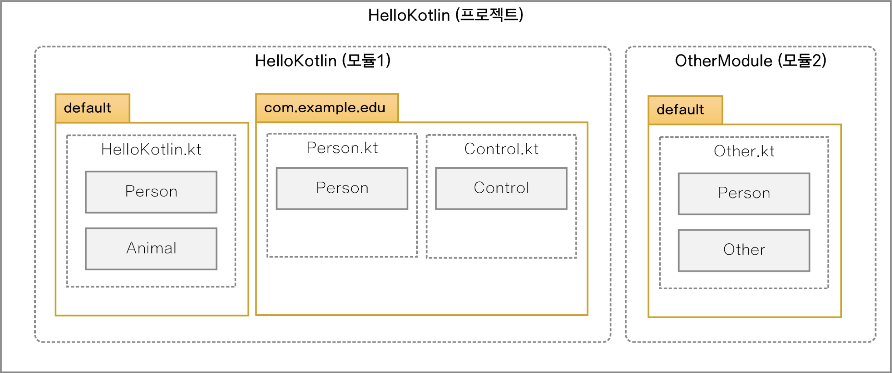
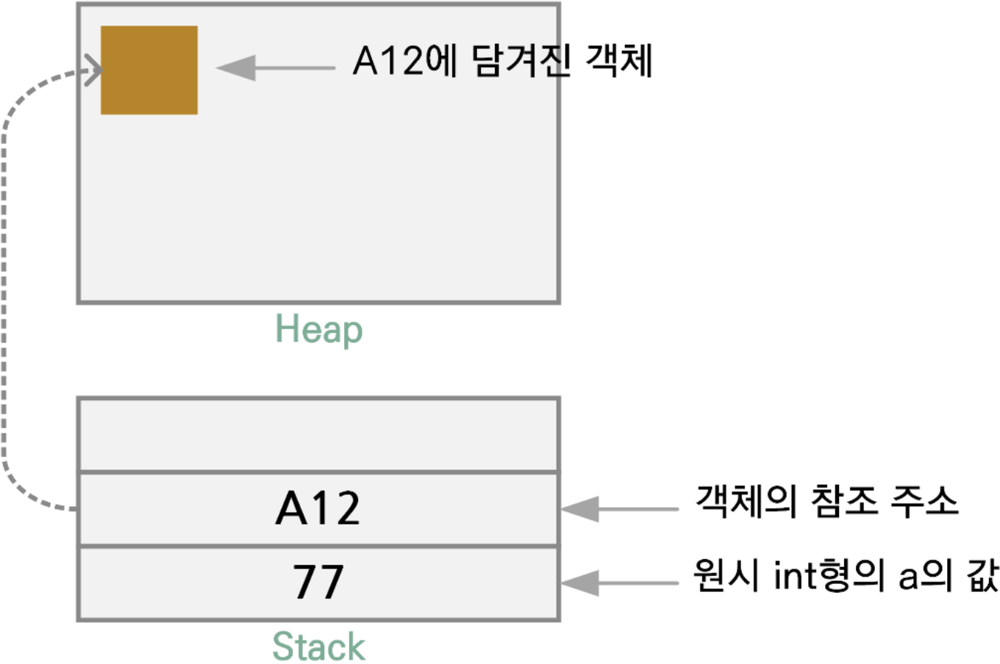
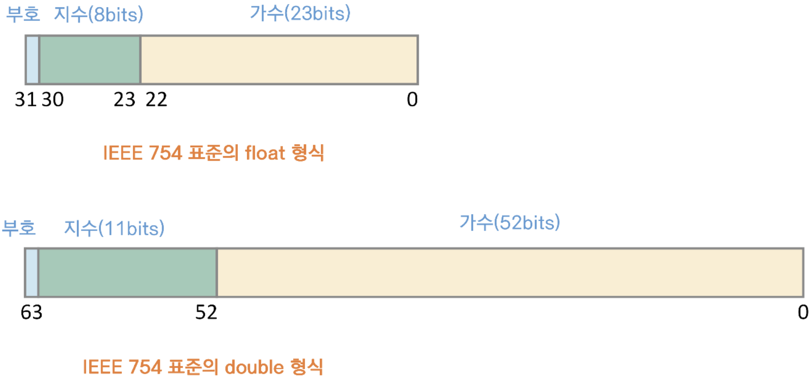
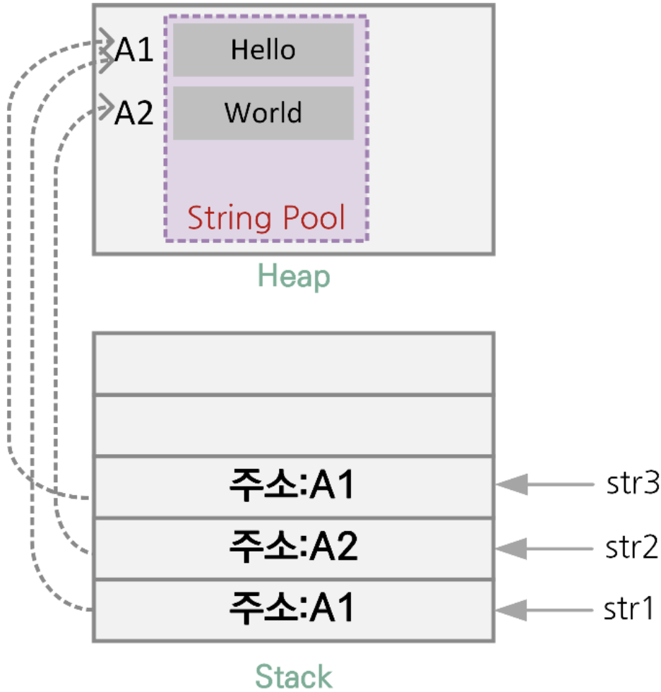

# 2장 - 변수와 자료형, 연산자

## 프로젝트와 패키지



## 패키지 정의

- Java Project 처럼 디렉토리와 맞지 않아도 됨
- 패키지를 지정하지 않으면 이름이 없는 기본(default) 패키지에 속함
- import 의 이름이 충돌하면 as 키워드로 로컬에서 사용할 이름을 변경해서 충돌을 피할 수 있다.
- import 는 클래스 뿐만 아니라 다른것도 import 할 수 있다.
    - 최상위레벨 함수와 property, object 선언 함수와 property, 열거형 상수 등

## 자료형과 변수

- 자료형
    - Int
    - String
    - Float
- 변수
    - val (value) - 불변형(Immutable)
    - var (variable) - 가변형(Mutable)

## 변수 선언

```kotlin
val username: String = "GilDong"
// val(선언키워드) username(변수이름): String(자료형) = "GilDong"(값)
```

### 예시

```kotlin
val username = "GilDong" // 자료형을 추론하여 String 으로 결정
```

```kotlin
val username // 자료형을 지정하지 않은 변수는 사용할 수 없다.
```

```kotlin
val init: Int // 사용전 혹은 생성자 시점에서 init 변수를 초기화 해야함
```

```kotlin
val number = 10 // number 변수는 Int 형으로 추론
```

- 변수 이름은 `123abc` 와 같이 숫자로 시작하면 안 됨
- 변수 이름에는 `while`, `if` 와 같이 Kotlin 에서 사용하는 키워드는 사용할 수 없음
- 변수 이름은 의미 있는 단어를 사용하여 만드는 것이 좋음
- 여러 단어를 사용하여 변수 이름을 지을 경우 CamelCase 로 작성

## 변수 명

### 일반 변수, 함수명 등 (단봉 낙타와 같은 Camel Expression)

- camelCase
- numberOfBooks
- myFirstNumber

### Class, Interface 등 (쌍봉 낙타 혹은 Pascal Expression)

- AnimalCategory
- CarEngine

## 자료형 알아보기

### 기본형 (Primitive Data Type)

- 가공되지 않은 순수한 자료형으로 프로그래밍 언어에 내장
- int, long, float, double 등

### 참조형 (Reference Type)

- 동적 공안에 데이터를 둔 다음 이것을 참조하는 자료형
- Int, Long, Float, Double 등

### 기본형과 참조형의 동작 원리 이해하기

#### Java 의 기본형과 참조형의 원리



```java
int a=77; // 기본형
Person person=new Person(); // 객체 참조형으로 person 객체를 위해 참조 주소를 가진다.
```

- Kotlin 에서는 코딩 시 참조형만 사용되며 Kotlin 컴파일러가 자동적으로 최적화함
- 컴파일 과정을 거친 후 기본형이 사용됨

### 정수형

- 음수가 사용되는 부호 있는 자료형
    - Long: 8Bytes(64bits) -2^63 ~ 2^63 - 1
    - Int: 4Bytes(32bits) -2^31 ~ 2^31 -1
    - Short: 2Bytes(16bits) -32768 ~ 32767
    - Byte: 1Byte(8bits) -128 ~ 127
- 부호 없는 정수형(1.3버전 실험적)
    - ULong: 8Bytes(64bits) 0 ~ 2^64 - 1
    - UInt: 4Bytes(32bits) 0 ~ 2^32 - 1
    - UShort: 2Bytes(16bits) 0 ~ 65535
    - UByte: 1Byte(8bits) 0 ~ 255

### 자료형 사용의 예

#### 자료형 생략

```kotlin
val num05 = 127 // Int 형으로 추론
val num06 = -32768 // Int 형으로 추론
val num07 = 2147483647 // Int 형으로 추론
val num08 = 9223372036854775808 // Long 형으로 추론
```

#### 접미사 접두사 사용

```kotlin
val exp01 = 123 // Int 형으로 추론
val exp02 = 123L // 접미사 L 을 사용해 Long 형으로 추론
val exp03 = 0x0F // 접두사 0x 를 사용해 16진 표기가 사용된 Int 형으로 추론
val exp04 = 0b00001011 // 접두사 0b 를 사용해 2진 표기가 사용된 Int 형으로 추론
```

#### 작은 값의 사용

```kotlin
val exp08: Byte = 127 // 명시적으로 자료형을 지정(Byte)
val exp09 = 32767 // 명시적으로 자료형을 지정하지 않으면 Short 형 범위의 값도 Int 형으로 추론
val exp10: Short = 32767 // 명시적으로 자료형을 지정(Short)
```

#### 부호 없는 정수 자료형

```kotlin
val uint: UInt = 153u
val ushort: UShort = 65535u
val ulong: ULong = 46322342uL
val ubtye: UByte = 255u
```

#### 큰 수를 읽기 쉽게 하는 방법

- 읽기 쉽게 하기 위해 `_`(언더스코어)를 포함해 표현

```kotlin
val number = 1_000_000
val cardNum = 1234_1234_1234_1234L
val hexVal = 0xAB_CD_EF_12
val bytes = 0b1101_0010
```

### 실수형

- Double: 8Bytes(64bits) 약 4.9E-324 ~ 1.7E+308
- Float: 4Bytes(32bits) 약 1.4E-45 ~ 3.4E+38

```kotlin
val exp01 = 3.14 // Double 형으로 추론(기본)
val exp02 = 3.14F // 식별자 F 에 의해 Float 형으로 추론
```

## 부동 소수점 이해

### 32비트와 64비트의 부동 소수점의 표현



### 부동 소수점의 표현

- 12.375(10) 의 표현
    - 음수: -
        - 127(bias) 기준으로 구분
    - 절대값: 12.375
        - 1100.011(2)
        - 1.100011 x 2^3
        - 1생략
        - 100011 을 가수부에 표현
        - 2^3 -> 127+3 = 130(10) = 10000010(2)

### IEEE 방식의 부동 소수점 제한

공간 제약에 따른 부동 소수점 연산의 단점

```kotlin
fun main() {
    var num: Double = 0.1 // 0.0011001100110011... 반복 중간에 반올림

    for (x in 0..999) {
        num += 0.1
    }

    println(num) // 100이 나와야 하지만 100.09999999999859 출력  
}
```

### 2의 보수란?

#### 자료형의 최소/최대

- 음수는 2의 보수 표현을 사용해 연산됨
    - 절댓값의 이진수에 값을 뒤집고 1을 더함
- 예) -6(10)
    - 6의 2진값: 0000 0110(2)
    - 값 뒤집기: 1111 1001(2)
    - 1을 더하기: 1111 1010(2)
- 제한된 자료형을 음수/양수로 나누어 최대한 사용하며 2의 보수는 가산 회로만으로 뺄셈을 표현할 수 있기 때문

## 그 밖의 자료형 알아보기

### 논리형

- Boolean: 1bit true,false

```kotlin
val isOpen = true // isOpen 은 Boolean 으로 추론
val isUploaded: Boolean // 선언만 한 경우 자료형(Boolean) 반드시 명시
```

### 문자형

- Char: 2Bytes(16bits) 0 ~ 2^15 - 1(\u0000 ~ \uffff)

```kotlin
val ch = 'c' // ch 는 Char 로 추론
val ch2: Char // 선언만 한 경우 자료형(Char) 반드시 명시
```

### 문자열

String 으로 선언되며 String Pool 이라는 공간에 구성



```kotlin
fun main() {
    var str1: String = "Hello"
    var str2 = "World"
    var str3 = "Hello"
    // 값이 동일한 String 변수는 참조형 주소가 동일함

    println("str1 === str2: ${str1 === str2}")
    println("str1 === str3: ${str1 === str3}")
}
```

## 표현식에서 문자열

### 표현식과 `$` 기호 사용하여 문자열 출력하기

```kotlin
var a = 1
val s1 = "a is $a" // String 자료형의 s1 을 선언하고 초기화, 변수 a 가 사용됨
```

### StringExpression.kt

```kotlin
fun main() {
    var a = 1
    val str1 = "a = $a"
    val str2 = "a = ${a + 2}" // 문자열에 표현식 사용
    
    println("str1: \"$str1\", str2: \"$str2\"")
}
```