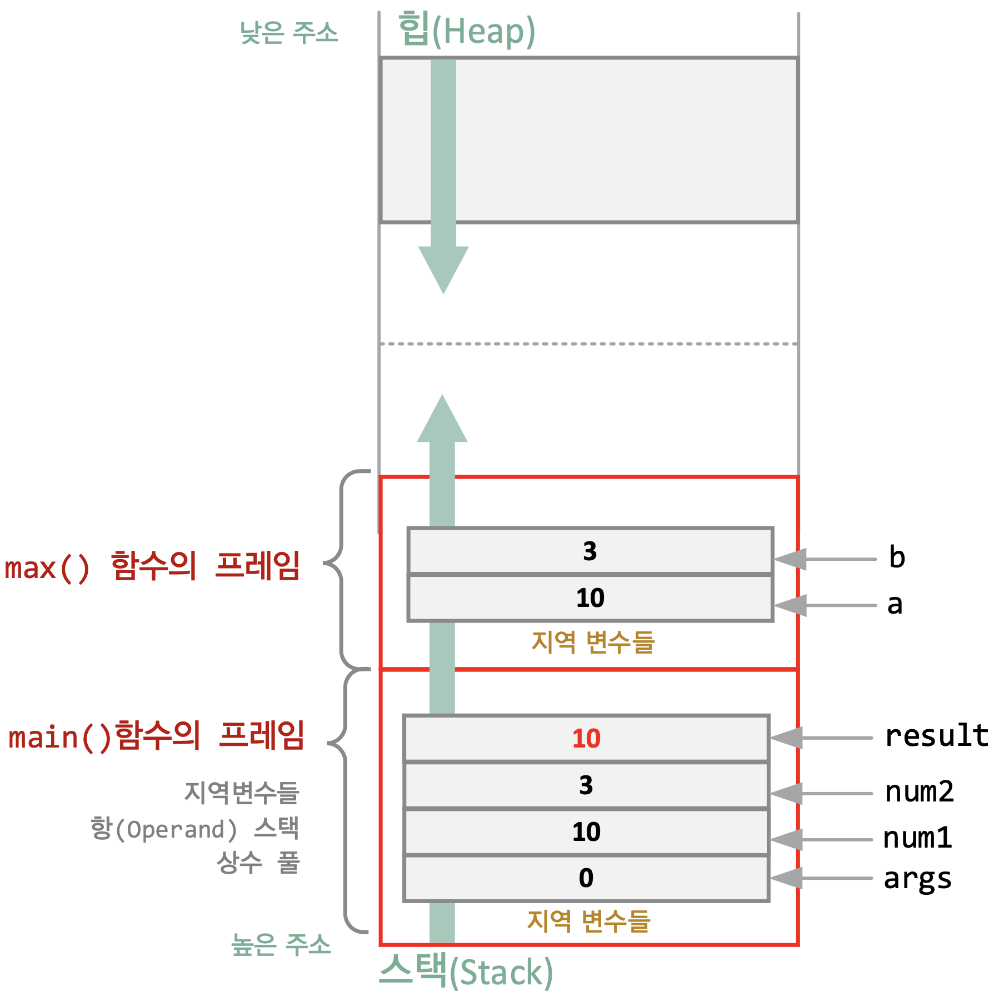
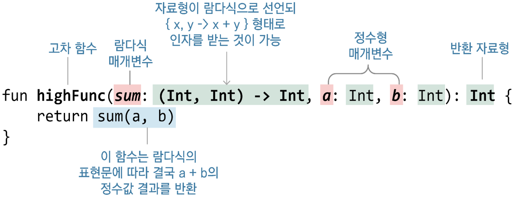

# 3장 - 함수와 함수형 프로그래밍

## 함수란?

```kotlin
fun sum(a: Int, b: Int): Int {
    var sum = a + b
    return sum
}
```

```text
fun 함수 이름([변수 이름: 자료형, 변수 이름: 자료형..]): [반환값의 자료형] {
    표현식..
    [return 반환값]
}
```

### 함수를 간략하게 표현하기

- 일반적인 함수의 모습

```kotlin
fun sum(a: Int, b: Int): Int = a + b // 함수가 한 줄 일때 사용

fun sum(a: Int, b: Int) = a + b // 반환 자료형 생략
```

- main() 함수 선언하고 호출하기

```kotlin
fun sum(a: Int, b: Int): Int {
    var sum = a + b
    return sum
}

fun main() {
    val result1 = sum(3, 2)
    val result2 = sum(6, 7)

    println(result1)
    println(result2)
}
```

- 함수의 호출 원리 살펴보기

```kotlin
fun main() {
    val num1 = 10
    val num2 = 3
    val result: Int

    result = max(num1, num2)
    println(result)
}

fun max(a: Int, b: Int) = if (a > b) a else b
```



- 함수 프레임들이 쌓여 Stack 이 꽉차게돼 더 이상 들어가지 못하는 상태: StackOverFlow
- 참조가 제거되지 않고 계속 남아있어 Heap 영역을 넘어서게 되는 현상: Out-of-Memory(OOM)

### 반환값이 없는 함수

#### Unit 형

```kotlin
fun printSum(a: Int, b: Int): Unit { // Unit 은 반환하는 값의 특정 자료형이 없는경우 사용(생략가능)
    println("sum of $a and $b is ${a + b}")
    // return Unit <- 생략되어 있음
}
```

```kotlin
fun printSum(a: Int, b: Int) {
    println("sum of $a and $b is ${a + b}")
}
```

### 매개변수의 기본값

#### 일반적인 함수 사용

```kotlin
fun add(name: String, email: String) {
    // name 과 email 을 회원 목록에 저장
}

add("kim", "default")
add("lee", "default")
add("park", "default")
```

```kotlin
fun add(name: String, email: String = "default") {
    // name 과 email 을 회원 목록에 저장
    // email 의 기본값은 "default" 즉, email 로 넘어오는 값이 없으면 자동으로 "default" 입력
}

add("kim") // email 인자를 생략하여 호출
```

- 함수의 매개변수에 기본값 지정하기

```kotlin
fun main() {
    val name = "홍길동"
    val email = "hong@example.kr"

    add(name)
    add(name, email)
    add("둘리", "dooly@example.kr")
    defaultArgs()
    defaultArgs(200)
}

fun add(name: String, email: String = "default") {
    val output = "$name 님의 이메일은 $email 입니다."
    println(output)
}

fun defaultArgs(x: Int = 100, y: Int = 200) {
    println(x + y)
}
```

- 매개변수 이름과 함께 함수 호출하기

```kotlin
fun main() {
    namedParam(x = 200, z = 100)
    namedParam(z = 150)
}

fun namedParam(x: Int = 100, y: Int = 200, z: Int) {
    println(x + y + z)
}
```

### 매개변수의 개수가 고정되지 않은 함수

#### 가변적인 매개변수 받기

```kotlin
fun print3Numbers(num1: Int, num2: Int, num3: Int) {
    println("num1: $num1, num2: $num2, num3: $num3")
}
fun print4Numbers(num1: Int, num2: Int, num3: Int, num4: Int) {
    println("num1: $num1, num2: $num2, num3: $num3, num4: $num4")
}
```

- 다양한 인자의 개수를 전달받는 함수

```kotlin
fun main() {
    normalVarargs(1, 2, 3, 4)
    normalVarargs(4, 5, 6)
}

fun normalVarargs(vararg counts: Int) {
    for (num in counts) {
        println("$num")
    }
    print("\n")
}
```

## 함수형 프로그래밍

- Kotlin 은 다중 패러다임 언어
    - 함수형 프로그래밍(FP: Functional Programming)
        - 코드 간략, 테스트나 재사용성 증가
        - 람다식, 고차 함수를 사용해 구성
        - 순수 함수
    - 객체 지향 프로그래밍(OOP: Object-Oriented Programming)

### 순수 함수

#### 순수 함수(Pure Function) 이해

- Side Effect 가 없는 함수
    - 동일한 입력 인자에 대해서는 항상 같은 결과를 출력 혹은 반환
    - 값이 예측이 가능해 결정적(deterministic)

```kotlin
fun sum(a: Int, b: Int): Int {
    return a + b
}
```

- 순수 함수의 조건
    - 같은 인자에 대하여 항상 같은 값을 반환
    - 함수 외부의 어떤 상태도 바꾸지 않음

```kotlin
fun check() {
    val test = User.grade() // check() 함수에 없는 외부 User 객체를 사용
    if (test != null) process(test) // 변수 test 는 User.grade() 의 실행 결과에 따라 달라짐
}
```

```kotlin
const val global = 10

fun main() {
    val num1 = 10
    val num2 = 3
    val result = noPureFunction(num1, num2)
    println(result)
}

fun noPureFunction(a: Int, b: Int): Int {
    return a + b + global // 입력값과 무관하게 외부의 변수 사용
}
```

- 순수 함수를 왜?
    - 입력과 내용을 분리하고 모듈화 하므로 재사용성이 높아짐
        - 여러가지 함수들과 조합해도 부작용이 없음
    - 특정 상태에 영향을 주지 않으므로 병행 작업 시 안전
    - 함수의 값을 추적하고 예측 할 수 있기때문에 테스트, 디버깅 등이 유리
- 함수형 프로그래밍에 적용
    - 함수를 매개변수, 인자에 혹은 반환값에 적용 (고차 함수)
    - 함수를 변수나 데이터 구조에 저장
    - 유연성 증가

## 람다식

### 람다식(Lambda Expression) 이란?

- 익명 함수의 하나의 형태로 이름 없이 사용 및 실행이 가능
- 람다 대수(Lambda Calculus)로 부터 유래

```kotlin
{ x, y -> x + y }
```

- 람다식의 이용
    - 람다식은 고차 함수에서 인자로 넘기거나 결과값으로 반환 등을 할 수 있음

## 일급 객체

### 일급 객체(First Class Citizen)란?

- 함수의 인자로 전달할 수 있음
- 함수의 반환값에 사용할 수 있음
- 변수에 담을 수 있음

- Kotlin 에서 함수는 1급 객체로 다룸
    - 1급 함수라고도 함

## 고차 함수의 이해

### 고차 함수(High-Order Function)란?

```kotlin
fun main() {
    println(highFunc({ x, y -> x + y }, 10, 20))
}

fun highFunc(sum: (Int, Int) -> Int, a: Int, b: Int): Int = sum(a, b)
```



## 함수형 프로그래밍 왜?

- 왜 사용해야 하나요?
    - 프로그램을 모듈화 하여 디버깅하거나 테스트가 쉬움
    - 간략한 표현식을 사용해 생산성이 높음
    - 람다식과 고차함수를 사용하면서 다양한 함수 조합을 사용할 수 있음
- 정리
    - 함수형 프로그래밍은 순수 함수를 조합해 상태 데이터 변경이나 부작용이 없는 루틴을 만듬
    - 이름 없는 함수 형태의 하나인 람다식을 이용해 함수를 변수처럼 매개변수, 인자, 반환값 등에 활용하는 고차 함수를 구성해 생산성을 높인 프로그래밍 방법

## 고차 함수의 형태

### 일반 함수를 인자나 반환값으로 사용하는 고차 함수

- 인자에 일반 함수 사용해 보기

```kotlin
fun main() {
    val res1 = sum(3, 2)
    val res2 = mul(sum(3, 3), 3)

    println("res1: $res1, res2: $res2")
}

fun sum(a: Int, b: Int) = a + b

fun mul(a: Int, b: Int) = a * b
```

- 반환값에 일반 함수 사용해 보기

```kotlin
fun main() {
    println("funcFunc: ${funcFunc()}")
}

fun sum(a: Int, b: Int) = a + b

fun funcFunc(): Int {
    return sum(2, 2)
}
```

### 람다식의 구성

- 변수에 할당하는 람다식 함수 작성하기

```kotlin
fun main() {
    var result: Int

    val multi = { x: Int, y: Int -> x * y }
    result = multi(10, 20)
    println(result)
}
```

- 변수에 지정된 람다식

```kotlin
val multi: (Int, Int) -> Int = { x: Int, y: Int -> x * y }
// val multi(변수를 함수처럼 사용 가능): (Int, Int)(람다식의 선언 자료형은 람다식 매개변수에 자료형이 명시된 경우 생략 가능) -> Int = { x: Int(선언 자료형이 명시되어 있으면 생략 가능), y: Int -> x * y }
// 람다식의 처리내용과 결과 반환, 표현식이 여러 줄인 경우 마지막 표현식이 반환
```

- 표현식이 2줄 이상일 때

```kotlin
val multi2: (Int, Int) -> Int = { x: Int, y: Int ->
    println("x * y")
    x * y
}
```

- 자료형의 생략

```kotlin
val multi: (Int, Int) -> Int = { x: Int, y: Int -> x * y } // 생략되지 않은 전체 표현
val multi = { x: Int, y: Int -> x * y } // 선언 자료형 생략
val multi: (Int, Int) -> Int = { x, y -> x * y } // 람다식 매개변수 자료형의 생략
val multi = { x, y -> x * y } // 타입 추론이 불가능하여 에러발생
```

- 반환 자료형이 없거나 매개변수가 하나 있을 때

```kotlin
val greet: () -> Unit = { println("Hello World") }
val square: (Int) -> Int = { x -> x * x }
```

- 람다식 안에 람다식이 있는 경우?

```kotlin
val nestedLambda: () -> () -> Unit = { { println("nested") } }
```

- 선언부의 자료형 생략

```kotlin
val greet = { println("Hello World") } // 추론 가능
val square = { x: Int -> x * x } // 선언 부분을 생략하려면 x의 자료형을 명시해야 함
val nestedLambda = { { println("nested") } } // 추론 가능
```

- 매개변수에 람다식 함수를 이용한 고차 함수

```kotlin
fun main() {
    var result: Int

    result = highOrder({ x, y -> x + y }, 10, 20)
    println(result)
}

fun highOrder(sum: (Int, Int) -> Int, a: Int, b: Int): Int {
    return sum(a, b)
}
```

### 람다식과 고차함수 호출하기

- 값에 의한 호출
    - 함수가 인자로 전달될 경우 -> 람다식 함수는 값으로 처리되어 그 즉시 함수가 수행된 후 값을 전달

- 값에 의한 호출로 람다식 사용하기

```kotlin
fun main() {
    val result = callByValue(lambda())
    println(result)
}

fun callByValue(b: Boolean): Boolean {
    println("callByValue Function")
    return b
}

val lambda: () -> Boolean = {
    println("lambda function")
    true
}
```

- 람다식 이름을 사용한 호출 이용하기

```kotlin
fun main() {
    val result = callByName(otherLambda)
    println(result)
}

fun callByName(b: () -> Boolean): Boolean {
    println("callByName function")
    return b()
}

val otherLambda: () -> Boolean = {
    println("otherLambda function")
    true
}
```

### 다른 함수의 참조에 의한 호출

```kotlin
fun sum(x: Int, y: Int) = x + y

// funcParam(3, 2, sum) // sum 은 람다식이 아니기 떄문에 에러!
funcParam(3, 2, ::sum)

fun funcParam(a: Int, b: Int, c: (Int, Int) -> Int): Int {
    return c(a, b)
}
```

- 참조에 의한 호출 방식으로 함수 호출하기

```kotlin
fun main() {
    // 1. 인자와 반환값이 있는 함수
    var res1 = funcParam(3, 2, ::sum)
    println(res1)

    // 2. 인자가 없는 함수
    hello(::text)

    // 3. 일반 변수에 값처럼 할당
    var likeLambda = ::sum
    println(likeLambda(6, 6))
}

fun sum(a: Int, b: Int) = a + b

fun text(a: String, b: String) = "Hi! $a $b"

fun funcParam(a: Int, b: Int, c: (Int, Int) -> Int): Int {
    return c(a, b)
}

fun hello(body: (String, String) -> String) {
    println(body("Hello", "World"))
}
```

### 람다식 함수의 매개변수

#### 매개변수 개수에 따라 람다식을 구성하는 방법

- 매개 변수가 없는 경우

```kotlin
fun main() {
    noParam({ "Hello World" })
    noParam { "Hello World" } // 위 결과와 동일, 소괄호 생략 가능
}

// 매개변수가 없는 람다식 함수가 noParam 함수의 매개변수 out 으로 지정
fun noParam(out: () -> String) = println(out())
```

- 매개변수가 한 개 인 경우

```kotlin
fun main() {
    oneParam({ a -> "Hello World! $a" })
    oneParam { a -> "Hello World! $a" } // 위 결과와 동일, 소괄호 생략 가능
    oneParam { "Hello World! $it" } // 위 결과와 동일, it 으로 대체 가능
}

fun oneParam(out: (String) -> String) {
    println(out("OneParam"))
}
```

- 매개변수가 두 개 인 경우

```kotlin
fun main() {
    moreParam { a, b -> "Hello World! $a $b" } // 매개변수명 생략 불가
}

// 매개변수가 두 개 있는 람다식 함수가 moreParam 함수의 매개변수로 지정
fun moreParam(out: (String, String) -> String) {
    println(out("OneParam", "TwoParam"))
}
```

- 매개변수를 생략하는 경우

```kotlin
moreParam { _, b -> "Hello World $b" } // 첫 번째 문자열은 사용하지 않고 생략
```

- 일반 매개변수와 람다식 매개변수를 같이 사용

```kotlin
fun main() {
    withArgs("Arg1", "Arg2", { a, b -> "Hello World! $a $b" })
    // withArgs() 의 마지막 인자가 람다식인 경우 소괄호 바깥으로 분리 가능
    withArgs("Arg1", "Arg2") { a, b -> "Hello World! $a $b" }
}

fun withArgs(a: String, b: String, out: (String, String) -> String) {
    println(out(a, b))
}
```

- 두 개의 람다식을 가진 함수의 사용

```kotlin
fun main() {
    twoLambda({ a, b -> "First $a $b" }, { "Second $it" })
    twoLambda({ a, b -> "First $a $b" }) { "Second $it" }
}

fun twoLambda(first: (String, String) -> String, second: (String) -> String) {
    println(first("OneParam", "TwoParam"))
    println(second("OneParam"))
}
```

## 고차 함수와 람다식 활용

### 동기화를 위한 코드 구현하기

- 동기화?
    - 변경이 일어나면 안 되는 특정 코드를 보호하기 위한 잠금 기법
    - 동기화로 보호되는 코드는 임계 영역(Critical Section)
    - Lock 을 활용해 임계 영역을 보호
- Java Lock 과 ReentrantLock

```java
Lock lock=new ReentrantLock();
        lock.lock();
        try{
        // 보호할 임계 영역의 코드
        // 수행할 작업
        }finally{
        lock.unlock();
        }
``` 

**선점(Preemptive)이란 다른 스레드나 프로세스를 중단 시키는 행위로 OS 의 스케쥴러가 담당**

#### ReentrantLock 을 활용해 특정 함수 보호

- 고차함수를 이용해 구현

```kotlin
fun <T> lock(reLock: ReentrantLock, body: () -> T): T {
    reLock.lock()
    try {
        return body()
    } finally {
        reLock.unlock()
    }
}
```

- 공유자원을 접근하는 코드를 보호하기

```kotlin
var sharable = 1 // 보호가 필요한 공유 자원

fun main() {
    val reLock = ReentrantLock()

    lock(reLock, { ciriticalFunc() })
    lock(reLock) { ciriticalFunc() }
    lock(reLock, ::criticalFunc)

    println(sharable)
}

fun criticalFunc() {
    sharable += 1
}
```

### 네트워크 호출 구현하기

#### 네트워크 처리 결과에 따른 CallBack 함수 구현

- 기존의 Java Code

```java
public interface CallBack {
    void onSuccess(ResultType result);

    void onError(Exception exception);
}

    public void networkCall(CallBack callback) {
        try {
            callback.onSuccess(myResult);
        } catch (Exception e) {
            callback.onError(e);
        }
    }

    networkCall(new CallBack() {
        public void onSuccess (ResultType result){
            // 네트워크 호출에 성공했을 때
        }
        public void onError (Exception e){
            // 네트워크 호출에 실패했을 때
        }
    })
```

- Kotlin Code

```kotlin
fun networkCall(onSuccess: (ResultType) -> Unit, onError: (Throwable) -> Unit) {
    try {
        onSuccess(myResult)
    } catch (e: Throwable) {
        onError(e)
    }
}

networkCall(result -> {
    // 네트워크 호출에 성공했을 때
}, error -> {
    // 네트워크 호출에 실패했을 때
})
```

## 익명 함수(Anonymous functions)

- 함수가 이름이 없는 것

```kotlin
fun(x: Int, y: Int): Int = x + y // 함수 이름이 생략된 익명 함수
```

```kotlin
val add: (Int, Int) -> Int = fun(x, y) = x + y
val result = add(10, 2)
```

```kotlin
val add = fun(x: Int, y: Int) = x + y
```

```kotlin
val add = { x: Int, y: Int -> x + y }
```

**일반 익명 함수에서는 return, break, continue 가 사용 사능하지만 람다식에서는 사용하기 어려움, 라벨 표기법과 같이 사용해야함**

## Inline 함수

- 함수가 호출되는 곳에 내용을 모두 복사
- 함수의 분기 없이 처리 -> 성능 증가

- Inline 함수 작성해 보기

```kotlin
fun main() {
    shortFunc(3) { println("First call: $it") }
    shortFunc(5) { println("Second call: $it") }
}

inline fun shortFunc(a: Int, out: (Int) -> Unit) {
    println("Before calling out()")
    out(a)
    println("After calling out()")
}
// 성능상의 이유로 Inline 함수는 일반 함수에도 사용할 수 있으나 람다식을 매개 변수로 가진 함수에 사용할 것을 추천
```

### Inline 함수의 제한과 Inline 금지

- Inline 함수의 단점
    - 코드가 복사되므로 내용이 많은 함수에 사용하면 코드가 늘어남
- `noinline` 키워드
    - 일부 람다식 함수를 인라인 되지 않게 함

```kotlin
inline fun sub(out1: () -> Uint, noinline out2: () -> Unit) {
}
```

- noinline 으로 람다식 함수의 인라인 막기

```kotlin
fun main() {
    shortFunc(3) { println("First call: $it") }
}

inline fun shortFunc(a: Int, noinline out: (Int) -> Unit) {
    println("Before calling out()")
    out(a)
    println("After calling out()")
}
```

### Inline 함수와 비지역 변환

- return 으로 빠져나오기

```kotlin
fun main() {
    shortFunc(3) {
        println("First call: $it")
        return // 의도하지 않은 반환
    }
}

inline fun shortFunc(a: Int, out: (Int) -> Unit) {
    println("Before calling out()")
    out(a)
    println("After calling out()") // 해당 문장은 실행되지 않음
}
```

### 비지역 반환의 금지

- clossinline 으로 return 금지

```kotlin
fun main() {
    shortFunc(3) {
        println("First call: $it")
        // return 사용 불가
    }
}

inline fun shortFunc(a: Int, crossinline out: (Int) -> Unit) {
    println("Before calling out()")
    nestedFunc { out(a) }
    println("After calling out()") // 해당 문장은 실행되지 않음
}

fun nestedFunc(body: () -> Unit) {
    body()
}
```

## 확장 함수(extension function)

- 클래스의 멤버 함수를 외부에서 더 추가할 수 있음

```text
fun 확장대상.확장명(매개변수, ...): 반환값 {
    return 값
}
```

- String 에 확장 함수 추가하기

```kotlin
fun main() {
    val source = "Hello World!"
    val target = "Kotlin"
    println(source.getLongString(target))
}

fun String.getLongString(target: String): String = if (this.length > target.length) this else target
```

- this 는 확장 대상에 있던 자리의 문자열인 source 객체
- 기존 표준 라이브러리를 수정하지 않고도 확장

## 중위 함수

- 중위 표현법(Infix notation)
    - 클래스의 멤버 호출 시 사용하는 `.` 을 생략하고 함수 이름 뒤에 소괄호를 생략해 직관적인 이름을 사용할 수 있는 표현법
- 중위 함수의 조건
    - 멤버 메소드 또는 확장 함수여야 함
    - 하나의 매개변수를 가져야 함
    - `infix` 키워드를 사용하여 정

- 중위 함수를 이용해 연산자처럼 사용하기

```kotlin
fun main() {
    //val multi = 3.multiply(10) // 일반적인 표현

    val multi = 3 multiply 10 // 중위 표현법
    println("multi: $multi")
}

// Int 함수 확장
infix fun Int.multiply(x: Int): Int {
    return this * x
}
```

## 꼬리 재귀 함수

- 재귀(Recursion)란
    - 자기 자신을 다시 참조
    - 재귀 함수는 자기 자신을 계속 호출하는 특징
- 재귀 함수의 필수 조건
    - 무한 호출에 빠지지 않도록 탈출 조건을 만듬
    - 스택 영역을 이용하므로 호출 횟수를 무리하게 많이 지정해 연산하지 않도록 해야함
    - 코드를 복잡하지 않게 함

**무한 호출에 빠지는 경우 Stack Over Flow 발생**

### 꼬리 재귀 함수(Tail Recursive function)

- 스택에 계속 쌓이는 방식이 함수가 계속 씌워지는 꼬리를 무는 형태
- Kotlin 고유의 tailrec 키워드를 사용해 선언

- factorial 재귀 함수 만들기

```kotlin
fun main() {
    val number = 4
    val result: Long

    result = factorial(number)
    println("Factorial: $number -> $result")
}

fun factorial(n: Int): Long {
    return if (n == 1) n.toLong() else n * factorial(n - 1)
}
```

- 꼬리 재귀로 스택오버플로 방지하기

```kotlin
fun main() {
    val number = 5
    println("Factorial: $number -> ${factorial(number)}")
}

tailrec fun factorial(n: Int, run: Int = 1): Long {
    return if (n == 1) run.toLong() else factorial(n - 1, run * n)
} 
```

### 피보나치 수열 재귀 함수

- 0, 1로 시작하여 n 번째 수와 n+1 번째 수의 합이 n+2 번째 수가 되는 수열

```kotlin
fun fibonacci(n: Int, a: Long, b: Long): Long {
    return if (n == 0) b else fibonacci(n - 1, a + b, a)
}
```

- 꼬리 재귀를 이용한 피보나치 수열

```kotlin

import java.math.BigInteger

fun main() {
    val n = 100
    val first = BigInteger("0")
    val second = BigInteger("1")

    println(fibonacci(n, first, second))
}

tailrec fun fibonacci(n: Int, a: BigInteger, b: BigInteger): BigInteger {
    return if (n == 0) a else fibonacci(n - 1, b, a + b)
}
```

## 함수의 실행 블록

- 함수의 블록 `{}`
    - 블록내에서 사용하는 변수 - 지역 변수(Local Variable)

### 함수의 범위(Scope)

- 최상위 함수와 지역 함수

```kotlin
fun main() { // 최상위 레벨의 함수
    fun secondFunc(a: Int) { // 지역 함수 선언

    }
    userFunc(4) // 사용자 함수 사용 - 선언부의 위치에 상관없이 사용
    secondFunc(2) // 지역 함수 사용 - 선언부가 먼저 나와야 사용 가능
}

fun userFunc(counts: Int) { // 사용자가 만든 최상위 레벨의 함수 선언
}
```

### 최상위 및 지역 함수의 사용 범위

- 최상위 함수는 `main()` 함수 전, 후 어디든 선언하고 코드 내에서 호출 가능
- 지역 함수는 먼저 선언되어야 그 함수를 호출할 수 있음

- 최상위 함수와 지역함수

```kotlin
fun a() = b() // 최상위 함수이므로 b() 함수 선언 위치에 상관 없이 사용 가능
fun b() = println("b") // b() 함수의 선언

fun c() {
    //fun d() = e() // d() 는 지역함수이므로 e() 의 이름을 모름
    fun e() = println("e")
}

fun main() {
    a()
    //e() // c() 함수에 정의된 e() 는 c 의 블록을 벗어난 곳에서 사용할 수 없음
}
```

## 변수의 범위

- 전역 변수
  - 최상위에 있는 변수로 프로그램이 실행되는 동안 삭제되지 않고 메모리에 유지
  - 여러 요소가 동시에 접근하는 경우에 잘못된 동작을 유발할 수 있음
  - 자주 사용되지 않는 전역 변수는 메모리 자원 낭비
- 지역 변수
  - 특정 코드 블록 내에서만 사용
  - 블록 시작 시 임시로 사용되며 주로 스택 메모리를 사용

- 지역 변수와 전역 변수의 범위
```kotlin
var global = 10

fun main() {
    val local1 = 20
    val local2 = 21
    
    fun nestedFunc() {
        global += 1
        val local1 = 30 // func() 함수 블록 내에서만 유지 (기존 local1 이 가려짐) Shadow
        println("nestedFunc local1: $local1")
        println("nestedFunc local2: $local2")
        println("nestedFunc global: $global")
    }
    
    nestedFunc()
    outsideFunc()
    println("main global: $global")
    println("main local1: $local1")
    println("main local2: $local2")
}

fun outsideFunc() {
    global += 1
    val outVal = "outside"
    println("outsideFunc global: $global")
    println("outsideFunc outVal: $outVal")
}
```