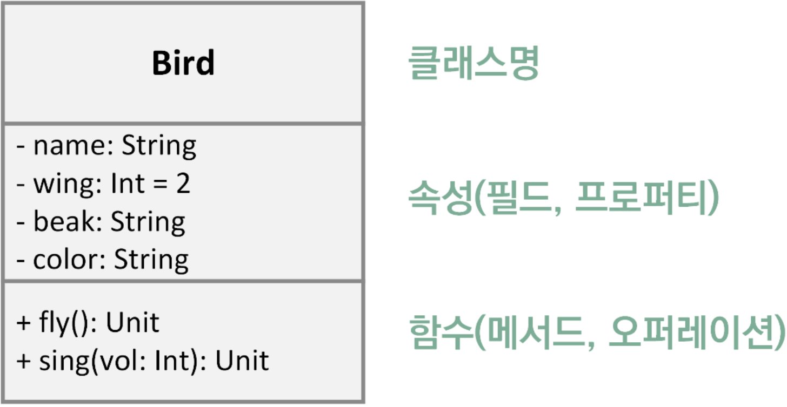
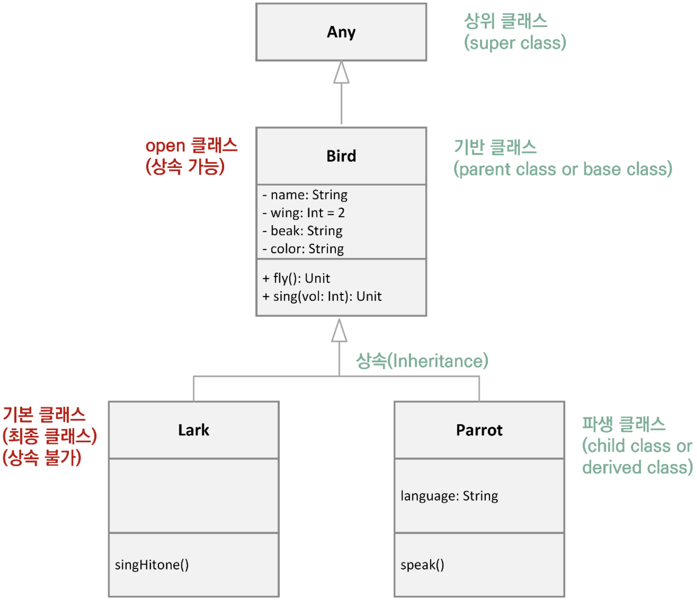

# 5장 - 클래스와 객체

## 클래스와 객체의 정의

### 객체 지향 프로그래밍 - OOP(Object-Oriented Programming)

- 프로그램의 구조를 객체 간 상효작용으로서 표현하는 프로그래밍 방식
- 절차적 프로그래밍의 한계를 극복하고자 나온 언어의 한 가지 방법론
- 객채와 관계를 표현하고 이를 통해 확장과 재사용이 용이

**Kotlin 에서는 OOP 를 지원**

### 객체지향의 기본 용어

- 객체지향 개념상의 용어들
    - 추상화(abstraction)
    - 인스턴스(instance)
    - 상속(inheritance)
    - 다형성(polymorphism)
    - 캡슐화(encapsulation)
    - 메시지 전송(message sending)
    - 연관(association)

### 클래스와 추상화

#### 클래스(Class) 란?

- 분류, 계층, 등급 등의 우리말 뜻
- 특정 대상을 분류하고 특징(속성)과 동작 활동(함수) 내용을 기록

#### 추상화(abstraction)

- 목표로 하는 것에 대해 필요한 만큼 속성과 동작을 정의하는 과정

### 객체지향 개념의 동의어들

- 객체지향 개념상의 용어가 언어마다 약간씩 다름
    - Class <-> 분류, 범주
    - Property <-> 속성(Attribute), 변수(Variable), 필드(Field), 데이터(Data)
    - Method <-> 함수(Function), 동작(Operation), 행동(Behavior)
    - Object <-> 인스턴스(Instance)

**Java 에서 사용하는 Field 는 Kotlin 에서 Property 라고함**

### Class Diagram

- Class 를 시각적으로 나타내 분석과 개념 구현에 용이



## Class

- 추상화 과정을 톤한 속성과 동작 골라내기

### Class 의 선언

- 빈 형태의 Class 선언

```kotlin
class Bird {} // 내용이 비어있는 클래스 선언
class Bird // 중괄호 생략 가능
```

- Class 내에 Property 와 Method 가 정의된 경우

```kotlin
class Bird {
    // Property
    // Method
}
```

- Bird Class 만들어 보기

```kotlin
class Bird {
    var name: String = "mybird"
    var wing: Int = 2
    var beak: String = "short"
    var color: String = "blue"

    fun fly() = println("Fly wing: $wing")
    fun sing(vol: Int) = println("Sing vol: $vol")
}

fun main() {
    val coco = Bird()
    coco.color = "blue"

    println("coco.color: ${coco.color}")
    coco.fly()
    coco.sing(3)
}
```

## 객체와 인스턴스 정리

### 객체(Object)

- Bird Class 란 일종의 선언일 뿐 실제 메모리에 존재해 실행되고 있는 것이 아님
- 객체(Object)는 물리적인 메모리 영역에서 실행되고 있는 Class 의 실체
    - 따라서 Class 로 부터 객체를 생성해 냄
    - 구체화 또는 인스턴스화(instantiate)되었다고 얘기할 수 있음
    - 메모리에 올라간 객체를 `Instance` 라고도 부름

## 생성자(Constructor) 란

- Class 를 통해 객체가 만들어질 때 기본적으로 호출되는 함수
- 객체 생성 시 필요한 값은 인자로 설정할 수 있게 함
- 생성자를 위해 특별한 함수인 `constructor()` 를 정의

```text
class 클래스명 constructor(필요한 매개변수들..) { <- 주 생성자 위치

    constructor(필요한 매개변수들..) { <- 부 생성자 위치
    }
    
    [constructor(필요한 매개변수들..) { ... }] <- 추가 부 생성자
}
```

### 생성자의 정의

- 주 생성자(Primary Constructor)
    - Class 명과 함께 기술되며 보통의 경우 `constructor` 키워드를 생략할 수 있음
- 부 생성자(Secondary Constructor)
    - Class 본문에 기술되며 하나 이상의 부 생성자를 정의할 수 있음

- 부 생성자를 사용하는 Bird Class

```kotlin
class Bird {
    var name: String
    var wing: Int
    var beak: String
    var color: String

    constructor(name: String, wing: Int, beak: String, color: String) {
        this.name = name
        this.wing = wing
        this.beak = beak
        this.color = color
    }

    fun fly() = println("Fly wing: $wing")
    fun sing(vol: Int) = println("Sing vol: $vol")
}

fun main() {
    val coco = Bird("mybird", 2, "short", "blue")
    coco.color = "blue"

    println("coco.color: ${coco.color}")
    coco.fly()
    coco.sing(3)
}
```

### `this` 키워드를 생략하는 경우

- 생성자의 매개변수와 Property 의 이름을 다르게 구성

```kotlin
class Bird {
    var name: String
    var wing: Int
    var beak: String
    var color: String

    // this 키워드를 생략하는 경우 매개변수 명에 `_` 를 붙혀 Property 와 이름을 다르게 함 
    constructor(_name: String, _wing: Int, _beak: String, _color: String) {
        name = _name
        wing = _wing
        beak = _beak
        color = _color
    }
}
```

### 부 생성자를 여러 개 포함한 Class

- Class 에 부 생성자를 하나 혹은 그 이상 포함할 수 있음

```text
class 클래스명 {
    constructor(매개변수[,매개변수...]) {
    }
    
    constructor(매개변수[,매개변수...]) {
    }
}
```

**매개변수는 서로 달라야 함**

- 여러 개의 부 생성자 지정의 예

```kotlin
class Bird {
    var name: String
    var wing: Int
    var beak: String
    var color: String

    // this 키워드를 생략하는 경우 매개변수 명에 `_` 를 붙혀 Property 와 이름을 다르게 함 
    constructor(_name: String, _wing: Int, _beak: String, _color: String) {
        name = _name
        wing = _wing
        beak = _beak
        color = _color
    }

    constructor(_name: String, _beak: String) {
        name = _name
        wing = 2
        beak = _beak
        color = "grey"
    }
}
```

- 객체 생성 시 생성자의 인자에 따라 부 생성자 선택

```kotlin
val bird1 = Bird("mybird", 2, "short", "blue")
val bird2 = Bird("mybird2", "long") 
```

### 주 생성자

- Class 명과 함께 생성자 정의

```kotlin
class Bird constructor(_name: String, _wing: Int, _beak: String, _color: String) {
    var name: String = _name
    var wing: Int = _wing
    var beak: String = _beak
    var color: String = _color
}
```

- constructor 키워드 생략

```kotlin
class Bird(_name: String, _wing: Int, _beak: String, _color: String) {
    var name: String = _name
    var wing: Int = _wing
    var beak: String = _beak
    var color: String = _color
}
```

- 가시성 지시자나 어노테이션 표기가 없을 경우 생략 가능

- Property 가 포함된 주 생성자

```kotlin
class Bird(var name: String, var wing: Int, var beak: String, var color: String) {
}
```

#### 주 생성자의 초기화 블럭

- 초기화 블럭이 포함된 주 생성자

```kotlin
class Bird(var name: String, var wing: Int, var beak: String, var color: String) {

    init { // 초기화 블럭 안에는 간단한 코드 허용
        println("----------초기화 블럭 시작----------")
        println("이름은 $name, 부리는 $beak")
        this.sing(3)
        println("----------초기화 블럭 끝----------")
    }

    fun fly() = println("Fly wing: $wing")
    fun sing(vol: Int) = println("Sing vol: $vol")
}
```

### Property 의 기본값 지정

- 생성시 필요한 기본값을 지정할 수 있음

```kotlin
class Bird(var name: String = "NONAME", var wing: Int = 2, var beak: String, var color: String) {
}

fun main() {
    val coco = Bird(beak = "long", color = "red")
    println("coco.name: ${coco.name}, coco.wing: ${coco.wing}")
    println("coco.color: ${coco.color}, coco.beak: ${coco.beak}")
}
```

## 상속과 다형성

### 상속과 클래스의 계층

- 상속(inheritance)
    - 자식 Class 를 만들 때 상위 Class(Parent Class)의 속성과 기능을 물려받아 계승
    - 상위(부모) Class 의 Property 와 Method 가 자식에 적용됨

#### 상속의 예

- 종달새(Lark) 와 앵무새(Parrot) Class



### 상속 가능한 Class 와 하위 Class 선언

- `open` 키워드를 통한 선언

```text
open class 기반 클래스명 { // `open` 으로 파생 가능 (다른 클래스가 상속 가능한 상태가 됨)
    ...
}

class 파생 클래스명 : 기반 클래스명() { // 기반 클래스로부터 상속, 최종 클래스로 파생 불가
    ...
}
```

- Kotlin 의 모든 클래스는 묵시적으로 `Any` 로 부터 상속


- 파생 Class 만들어 보기

```kotlin
open class Bird(var name: String, var wing: Int, var beak: String, var color: String) {
    fun fly() = println("Fly wing: $wing")
    fun sing(vol: Int) = println("Sing vol: $vol")
}

class Lark(name: String, wing: Int, beak: String, color: String) : Bird(name, wing, beak, color) {
    fun singHitone() = println("Happy Song!")
}

class Parrot : Bird {
    val language: String

    constructor(name: String, wing: Int, beak: String, color: String, _language: String) : super(
        name,
        wing,
        beak,
        color
    ) {
        language = _language
    }

    fun speak() = println("Speak! $language")
}

fun main() {
    val coco = Bird("mybird", 2, "short", "blue")
    val lark = Lark("mylark", 2, "long", "brown")
    val parrot = Parrot("myparrot", 2, "short", "multiple", "korean")

    println("Coco: ${coco.name}, ${coco.wing}, ${coco.beak}, ${coco.color}")
    println("Lark: ${lark.name}, ${lark.wing}, ${lark.beak}, ${lark.color}")
    println("Parrot: ${parrot.name}, ${parrot.wing}, ${parrot.beak}, ${parrot.color}, ${parrot.language}")

    lark.singHitone()
    parrot.speak()
    lark.fly()
}
```

- 하위 Class 는 상위 Class 의 Method 나 Property 를 그대로 상속하면서 상위 클래스에는 없는 자신만의 Property 와 Method 확장

### 다형성(Polymorphism)

- 다형성이란
    - 같은 이름을 사용하지만 구현 내용이 다르거나 매개변수가 달라서 하나의 이름으로 다향한 기능을 수행할 수 있는 개념

- Overriding
    - 기능을 완전히 다르게 바꾸어 재설계
    - 누르다 -> 행위 -> push()
    - `push()` 는 확인 혹은 취소 용도로 서로 다른 기능을 수행 할 수 있음
- Overloading
    - 기능은 같지만 인자를 다르게 하여 여러 경우를 처리
    - 출력한다 -> 행위 -> print()
    - `print(123)`, `print("Hello")` 인자는 다르지만 출력의 기능은 동일함

#### Overloading

- 일반 함수에서의 Overloading

```kotlin
fun add(x: Int, y: Int) = x + y
fun add(x: Double, y: Double) = x + y
fun add(x: Int, y: Int, z: Int) = x + y + z
```

- 덧셈 동작의 Overloading

```kotlin
fun main() {
    val calc = Calc()
    println(calc.add(3, 2))
    println(calc.add(3.2, 1.3))
    println(calc.add(3, 3, 2))
    println(calc.add("Hello", "World"))
}

class Calc {
    fun add(x: Int, y: Int) = x + y
    fun add(x: Double, y: Double) = x + y
    fun add(x: Int, y: Int, z: Int) = x + y + z
    fun add(x: String, y: String) = x + y
}
```

#### Overriding

- 개념 재정리
    - override 란 사전적 의미로 `기존의 작업을 중단하다`, `뒤엎다` 등으로 해석
    - 상위 Class 의 Method 의 내뇽을 완전히 새로 만들어 다른 기능을 하도록 정의
    - Overriding 하기 위해 부모 Class 에서는 `open` 키워드, 자식 Class 에서는 `override` 키워드를 각각 이용
        - Method 및 Property 등에 사용할 수 있음

- Method Overriding 의 예

```kotlin
open class Bird { // open 키워드로 인하여 상속 가능
    fun fly() {} // 최종 메소드로 오버라이딩 불가
    open fun sing() {} // 하위 클래스에서 오버라이딩 가능
}

class Lark() : Bird() {
    // fun fly() { } // 상위 메소드에 `open` 키워드가 없어 오버라이딩 불가 
    override fun sing() {}
}
```

##### Overriding 금지

- 파생 Class 에서 Overriding 을 금지할 때

```kotlin
open class Lark() : Bird() {
    final override fun sing() {} // 하위 클래스에서 재정의 금지
}
```

- Method 를 Overriding 하기

```kotlin
open class Bird(var name: String, var wing: Int, var beak: String, var color: String) {
    fun fly() = println("Fly wing: $wing")
    open fun sing(vol: Int) = println("Sing vol: $vol")
}

class Parrot(name: String, wing: Int = 2, beak: String, color: String, var language: String = "natural") :
    Bird(name, wing, beak, color) {

    fun speak() = println("Speak! $language")

    override fun sing(vol: Int) {
        println("I'm a parrot! The volume level is $vol")
        speak()
    }
}

fun main() {
    val parrot = Parrot(name = "myparrot", beak = "short", color = "multiple")
    parrot.language = "English"

    println("Parrot: ${parrot.name}, ${parrot.wing}, ${parrot.beak}, ${parrot.color}, ${parrot.language}")

    parrot.sing(5)
}
```