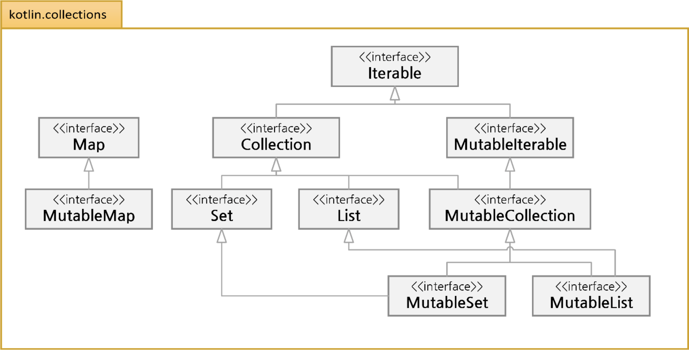

# Collection

## Collection 구조와 기본

### Collection 이란

- Collection
    - 자주 사용되는 기초적인 자료구조를 모아놓은 일종의 프레임워크로 표준 라이브러리로 제공

- Kotlin 의 Collection
    - Collection 의 종류로는 List, Set, Map 등이 있으며 Java 와는 다르게 불변형(immutable)과 가변형(mutable)으로 나뉘어 Collection 을 다룰 수 있음

- List: `listOf`, `mutableListOf`, `arrayListOf`
- Set: `setOf`, `mutableSetOf`, `hashSetOf`, `linkedSetOf`, `sortedSetOf`
- Map: `mapOf`, `mutableMapOf`, `hashMapOf`, `linkedMapOf`, `sortedMapOf`

### Collection Interface



- Kotlin Collection
    - 다이터그램의 가장 상위의 `Iterable` 인터페이스는 컬렉션이 연속적인 요소를 표현할 수 있게 함

- Collection Interface 의 특징
    - `Iterable` 로부터 확장
    - 불변형이므로 Collection 으로부터 확장된 Set 과 List 는 읽기 전용의 컬렉션

- Collection Interface 의 멤버
    - `size`: Collection 의 크기를 나타냄
    - `isEmpty()`: Collection 이 비어 있는 경우 `true` 반환
    - `contains(element: E)`: 특정 요소가 있다면 `true` 반환
    - `containsAll(element: Collection<E>)`: 인자로 받아들인 Collection 이 있다면 `true` 반환

#### `MutableIterable`과 `MutableCollection` Interface

- 특징
    - 가변형 Collection 을 지원하기 위해 준비된 Interface
    - 요소를 추가하거나 제거하는 등의 기능을 수행할 수 있음

- `MutableCollection` 의 멤버
    - `add(element: E)`: 인자로 전달받은 요소를 추가하고 `true` 반환, 이미 요소가 있거나 중복이 허용되지 않으면 `false` 반환
    - `remove(element: E)`: 인자로 받은 요소를 삭제하고 `true` 반환, 삭제하려는 요소가 없다면 `false` 반환
    - `addAll(elements: Collection<E>)`: Collection 을 인자로 전달받아 모든 요소를 추가하고 `true` 반환, 실패 시 `false` 반환
    - `removeAll(elements: Collection<E>)`: Collection 을 인자로 전달받아 모든 요소를 삭제하고 `true` 반환, 실패 시 `false` 반환
    - `retainAll(elements: Collection<E>)`: 인자로 전달받은 Collection 의 요소만 보유, 성공 시 `true` 반환, 실패 시 `false` 반환
    - `clear()`: Collection 의 모든 요소 삭제

## List 의 활용

### List

- 개념
    - 순서에 따라 정렬된 요소를 가지는 Collection(가장 많이 사용되는 Collection 중 하나)
    - 값을 변경할 수 없는 불변형 List 를 만들기 위해 Helper 함수인 `listOf()`를 사용
    - 값을 변경할 수 있는 가변형을 표현하기 위해서는 `mutableListOf()`를 사용
    - 인자는 원하는 만큼의 가변 인자를 가지도록 `vararg`로 선언 가능

**Helper 함수란 객체 생성 시 요소를 직접 선언하기 보다 특정 함수의 도움을 통해 생성**

### 불변형 List 생성하기

```kotlin
public fun <T> listOf(vararg elements: T): List<T>
```

- Helper 함수 `listOf()`의 원형
    - `vararg`는 가변 인자를 받을 수 있기 때문에 원하는 만큼 요소를 지정
    - 값을 반환할 때는 `List<T>`를 사용
    - 형식 매개변수 `<T>`는 필요에 따라 원하는 자료형을 지정해 선언
        - 사용하지 않으면 `<Any>`가 기본값이며 어떤 자료형이든 혼합 사용 가능

- 불변형 List 의 사용

```kotlin
fun main() {
    var numbers: List<Int> = listOf(1, 2, 3, 4, 5)
    var names: List<String> = listOf("one", "two", "three")

    for (name in names) {
        println(name)
    }

    for (num in numbers) print(num)
    println()
}
```

- 형식 매개변수 생략 예

```kotlin
val mixedTypes = listOf("Hello", 1, 2.445, 's')
```

#### Collection 에 접근할 때

- `for`와 `.indices` 멤버를 통한 접근

```kotlin
val fruits = listOf("apple", "banana", "kiwi")
for (item in fruits) {
    println(item)
}

for (index in fruits.indices) {
    println("fruits[$index] = ${fruits[index]}")
}
```

#### 기타 List 생성 함수

- `emptyList()` 함수: 빈 리스트를 생성

```kotlin
val emptyList: List<String> = emptyList()
```

- `listOfNotNull()` 함수: `null`을 제외한 요소만 반환

```kotlin
val nonNullsList: List<Int> = listOfNotNull(2, 45, 2, null, 5, null)
println(nonNullsList)
```

#### List 추가 멤버 메소드 사용

- `get(index: Int)`: 특정 인덱스를 인자로 받아 해당 요소를 반환
- `indexOf(element: E)`: 인자로 받은 요소가 첫 번째로 나타나는 인덱스를 반환, 없으면 -1 반환
- `lastIndexOf(element: E)`: 인자로 받은 요소가 마지막으로 나타나는 인덱스를 반환, 없으면 -1 반환
- `listIterator()`: 목록에 있는 iterator 를 반환
- `subList(fromIndex: Int, toIndex: Int)`: 특정 인텍스의 from 과 to 범위에 있는 요소 목록을 반환

### 가변형 List 생성

- `arrayListOf()` 함수
    - 가변형 Helper 함수를 사용하면 손쉽게 요소를 추가하거나 삭제할 수 있음
    - `arrayListOf()`는 가변형 List 를 생성하지만 반환자료형은 Java 의 `ArrayList`

```kotlin
public fun <T> arrayListOf(vararg elements: T): ArrayList<T>
```

- 가변형 List 사용해 보기

```kotlin
fun main() {
    val stringList: ArrayList<String> = arrayListOf("Hello", "Kotlin", "WoW")
    stringList.add("Java")
    stringList.remove("Hello")
    println(stringList)
}
```

#### MutableList Interface 를 이용하는 Helper 함수

- 가변형 `mutableListOf()` 함수
    - 요소의 추가, 삭제 또는 교체를 위해 `mutableListOf()`를 통해 생성
    - `MutableList` 형으로 반환

```kotlin
public fun <T> mutableListOf(vararg elements: T): MutableList<T>
```

- Kotlin 의 MutableList 이용하기

```kotlin
fun main() {
    val mutableList: MutableList<String> = mutableListOf("GilDong", "Dooly", "Chelsu")
    mutableList.add("Ben")
    mutableList.removeAt(1)
    mutableList[0] = "Jason"
    println(mutableList)

    val mutableListMixed = mutableListOf("Android", "Apple", 5, 6, 'X')
}
```

### 불변형 List 의 변경

- `toMutableList()`

```kotlin
fun main() {
    val names: List<String> = listOf("one", "two", "three")

    val mutableNames = names.toMutableList()
    mutableNames.add("four")
    println(mutableNames)
}
```

### List 와 배열의 차이

- 차이점 비교
    - Array 클래스에 의해 생성되는 배열 객체는 내부 구조상 고정된 크기를 가짐
    - Kotlin 의 `List<T>` 와 `MutableList<T>`는 Interface 로 설계되어 있고 이것을 하위에 특정한 자료구조로 구현
        - `LinkedList<T>`, `ArrayList<T>`
        - 고정된 크기의 메모리가 아니기 때문에 자료구조에 따라 늘리거나 줄이는 것이 가능
    - `Array<T>`는 Generic 관점에서 상/하위 자료형 관계가 성립하지 않는 **무변셩**
    - `List<T>`는 **공변성**이기 때문에 하위인 `List<Int>`가 `List<Number>`에 지정될 수 있음

```kotlin
import java.util.LinkedList

val list1: List<Int> = LinkedList<Int>()
val list2: List<Int> = ArrayList<Int>()
```

## Set 과 Map 의 활용

### Set

- 개념
    - 정해진 순서가 없는 요소들의 집합(Set)
    - 집합의 개념이기 때문에 동일한 요소를 중복해서 가질 수 없음
- 생성 Helper 함수
    - 불변형 Set: `setOf()`
    - 가변형 Set: `mutableSetOf()`

- 불변형 Set 의 초기화

```kotlin
fun main() {
    val mixedTypesSet = setOf("Hello", 5, "World", 3.14, 'c')
    var intSet: Set<Int> = setOf<Int>(1, 5, 5)

    println(mixedTypesSet)
    println(intSet) // 중복된 요소인 5가 하나만 나타남
}
```

- 가변형 Set 의 초기화

```kotlin
fun main() {
    val animals = mutableSetOf("Lion", "Dog", "Cat", "Python", "Hippo")
    println(animals)

    animals.add("Dog")
    println(animals)

    animals.remove("Python")
    println(animals)
}
```

#### Set 의 여러가지 자료구조

- `hashSetOf()` 함수
    - 해당 Helper 함수를 통해 생성하면 Hash Table 에 요소를 저장할 수 있는 Java 의 `HashSet` Collection 생성
    - HashSet 은 불변성 선언이 없기 때문에 추가 및 삭제 등의 기능을 수행할 수 있음

- Hash Table
    - Hash Table 이란 내부적으로 Key 와 Index 를 이용해 검색과 변경등을 매우 빠르게 처리할 수 있는 자료구조

- HashSet 의 초기화

```kotlin
fun main() {
    val intsHashSet: HashSet<Int> = hashSetOf(6, 3, 4, 7)
    intsHashSet.add(5)
    intsHashSet.remove(6)
    println(intsHashSet)
}
```

- HashSet 은 입력 순서와 중복된 요소는 무시
- 정렬 기능은 없지만 해시값을 통해 요소를 찾아내므로 검색 속도는 `O(1)` 의 상수시간
    - 필요한 값을 요청과 즉시 바로 찾아냄

#### Java 의 TreeSet Collection

- `sortedSetOf()` 함수
    - Java 의 TreeSet Collection 을 정렬된 상태로 반환
    - `java.util.*` 패키지를 import 해야함
    - TreeSet 은 저장된 데이터의 값에 따라 정렬
        - 이진 탐색 트리(binary-search tree)인 RB(red-black) 트리 알고리즘을 사용
    - HashSet 보다 성능이 좀 떨어지고 데이터를 추가하거나 삭제하는 데 시간이 걸리지만 검색과 정렬이 뛰어나다는 장점

- 이진 탐색 트리와 RB 트리
    - 이진 탐색 트리가 한쪽으로 치우친 트리 구조를 가지게 되는 경우 트리 높이만큼 시간이 걸리게 되는 최악의 경우 시간이 만들어 질 수 있음
    - RB 트리는 이 단점을 Red 와 Black 의 색상으로 치우친 결과 없이 구분되도록하여 최악의 경우에도 검색 등의 처리에서 일정 시간을 보장하는 자료구조

- TreeSet 의 초기화

```kotlin

import java.util.TreeSet

fun main() {
    val intsSortedSet: TreeSet<Int> = sortedSetOf(4, 1, 7, 2)
    intsSortedSet.add(6)
    intsSortedSet.remove(1)
    println("intsSortedSet = $intsSortedSet")
    intsSortedSet.clear()
    println("intsSortedSet = $intsSortedSet")
}
```

#### Java 의 LinkedHashSet

- `linkedSetOf()` 함수
    - Java 의 LinkedHashSet 자료형을 반환하는 Helper 함수
    - 자료구조 중 하나인 LinkedList 를 사용해 구현된 Hash Table 에 요소를 저장
    - HashSet, TreeSet 보다 느리지만 데이터 구조상 다음 데이터를 가리키는 포인터 연결을 통해 메모리 저장 공간을 좀 더 효율적으로 사용

### Map

- Map 의 개념
    - Key 와 Value 로 구성된 요소를 저장
        - Key 와 Value 는 모두 객체
    - Key 는 중복될 수 없지만 Value 는 중복 저장될 수 있음
        - 만약 기존에 저장된 Key 와 동일하면 기존의 Value 는 없어지고 새로운 Value 로 대체
- Map 의 생성
    - 불변형: `mapOf()`
    - 가변형: `mutableMapOf()`

#### 불변형 Map 의 생성

- `mapOf()` 함수

```text
val map: Map<Key 자료형, Value 자료형> = mapOf(Key to Value[, ...])
```

- Key 와 쌍은 `Key to Value` 형태로 나타냄

```kotlin
fun main() {
    val langMap: Map<Int, String> = mapOf(11 to "Java", 22 to "Kotlin", 33 to "C++")
    for ((key, value) in langMap) {
        println("key = $key, value = $value")
    }
    println("langMap[22] = ${langMap[22]}")
    println("langMap.get(22) = ${langMap.get(22)}")
    println("langMap.keys = ${langMap.keys}")
}
```

#### Map 의 멤버

- `size`: Map Collection 의 크기를 반환
- `keys`: Map 의 모든 Key 를 반환
- `values`: Map 의 모든 Value 를 반환
- `isEmpty()`: Map 이 비어 있는지 확인하고 비어 있으면 `true`, 아니면 `false`
- `containsKey(key: K)`: 인자에 해당하는 Key 가 있다면 `true`, 아니면 `false`
- `containsValue(value: V)`: 인자에 해당하는 Value 가 있다면 `true`, 아니면 `false`
- `get(key: K)`: Key 에 해당하는 Value 를 반환, 없으면 `null`

#### MutableMap 의 추가 멤버

- `put(key: K, value: V)`: Key 와 Value 의 쌍을 Map 에 추가
- `remove(key: K)`: Key 에 해당하는 요소를 Map 에서 제거
- `putAll(from: Map<out K, V>)`: 인자로 주어진 Map 데이터를 갱신하거나 추가
- `clear()`: 모든 요소 삭제

- 가변형 Map 사용하기

```kotlin
fun main() {
    val capitalCityMap: MutableMap<String, String> =
        mutableMapOf("Korea" to "Seoul", "China" to "Beijing", "Japan" to "Tokyo")

    println(capitalCityMap.values)
    println(capitalCityMap.keys)
    capitalCityMap["UK"] = "London"
    capitalCityMap.remove("China")
    println(capitalCityMap)
}
```

##### `putAll()` 을 사용한 Map 객체 통합

- 기존 요소에 추가된 요소를 병합할 수 있음

```kotlin
fun main() {
    val capitalCityMap: MutableMap<String, String> =
        mutableMapOf("Korea" to "Seoul", "Japan" to "Tokyo", "UK" to "London")

    val addData = mutableMapOf("USA" to "Washington")
    capitalCityMap.putAll(addData)
    println(capitalCityMap)
}
```

#### Map 을 위한 기타 자료구조

- 특정 자료구조 이용
    - Map 에서도 Java 의 HashMap, SortedMap, LinkedHashMap 을 사용할 수 있음
    - `hashMapOf()`, `sortedMapOf()`, `linkedMapOf()`로 각각 초기화
    - SortedMap 의 경우 기본적으로 Key 에 대해 오름차순 정렬된 형태
    - Hash, Tree, LinkedList 자료구조로 구현

- 기타 Map 의 자료구조 사용하기

```kotlin

import java.util.SortedMap

fun main() {
    val hashMap: HashMap<Int, String> = hashMapOf(1 to "Hello", 2 to "World")
    println("hashMap = $hashMap")

    val sortedMap: SortedMap<Int, String> = sortedMapOf(1 to "Apple", 2 to "Banana")
    println("sortedMap = $sortedMap")

    val linkedHashMap: LinkedHashMap<Int, String> = linkedSetOf(1 to "Computer", 2 to "Mouse")
    println("linkedHashMap = $linkedHashMap")
}
```

## Collection 의 확장 함수

- Kotlin 은 Collection 을 위한 많은 확장 함수 제공
- 확장 함수 범주
    - 연산자(operators) 기능의 메소드: 더하고 빼는 등의 기능
    - 집계(aggregators) 기능의 메소드: 최대, 최소, 집합, 총합 등의 계산 기능
    - 검사(checks) 기능의 메소드: 요소를 검사하고 순환하기 위한 기능
    - 필터(filtering) 기능의 메소드: 원하는 요소를 골라내기 위한 기능
    - 변환(transformers) 기능의 메소드: 뒤집기, 정렬, 자르기 등의 변환 기능

- Collection 에 대한 연산 테스트하기

```kotlin
fun main() {
    val list1: List<String> = listOf("one", "two", "three")
    val list2: List<Int> = listOf(1, 3, 4)
    val map1 = mapOf("hi" to 1, "hello" to 2, "Goodbye" to 3)

    println(list1 + "four")
    println(list2 + 1)
    println(list2 + listOf(5, 6, 7))
    println(list2 - 1)
//    println(list2 - listOf(3, 4, 5))
    println(list2 - setOf(3, 4, 5))
    println(map1 + Pair("Bye", 4))
    println(map1 - "hello")
    println(map1 + mapOf("Apple" to 4, "Orange" to 5))
//    println(map1 - listOf("hi", "hello"))
    println(map1 - setOf("hi", "hello"))
}
```

### 요소의 처리와 집계에 대한 연산

- 요소 집계를 위한 확장 함수
    - `forEach`, `forEachIndexed`, `onEach`, `count`, `max`, `min`, `maxBy`, `minBy`, `fold`, `reduce`, `sumBy` 등
- 요소의 순환
    - `forEach`: 각 요소를 람다식으로 처리한 후 Collection 을 반환하지 않음
    - `onEach`: 각 요소를 람다식으로 처리한 후 Collection 을 반환 받음

- 요소의 순환 예

```kotlin
fun main() {
    val list = listOf(1, 2, 3, 4, 5, 6)
    val listPair = listOf(Pair("A", 300), Pair("B", 200), Pair("C", 100))
    val map = mapOf(11 to "Java", 22 to "Kotlin", 33 to "C++")

    list.forEach { print("$it") }
    println()
    list.forEachIndexed { index, value -> println("index[$index]: $value") }
}
```

- `onEach`를 사용해 반환 받는 경우

```kotlin
fun main() {
    val list = listOf(1, 2, 3, 4, 5, 6)
    val map = mapOf(11 to "Java", 22 to "Kotlin", 33 to "C++")

    val returnedList = list.onEach { print(it) }
    println()
    val returnedMap = map.onEach { println("key: ${it.key}, value: ${it.value}") }
    println("returnedList = $returnedList")
    println("returnedMap = $returnedMap")
}
```

- 각 요소의 정해진 식 적용
    - `fold`와 `reduce`: 초기값과 정해진 식에 따라 요소에 처리하기 위함
        - `fold`는 초기값과 정해진 식에 따라 처음 요소부터 끝 요소에 적용해 값 반환
        - `reduce`는 `fold`와 동일하지만 초기값을 사용하지 않음
    - `foldRight`, `reduceRight`: 위의 개념과 동일하지만 요소의 마지막 요소에서 처음 요소로 순서대로 적용

- `fold`와 `reduce`의 예

```kotlin
fun main() {
    val list = listOf(1, 2, 3, 4, 5, 6)
    println(list.fold(4) { total, next -> total + next })
    println(list.fold(1) { total, next -> total * next })

    println(list.foldRight(4) { total, next -> total + next })
    println(list.foldRight(1) { total, next -> total * next })

    println(list.reduce { total, next -> total + next })
    println(list.reduceRight { total, next -> total + next })
}
```

### 매핑 관련 연산

- `map()`
    - 주어진 Collection 의 요소를 일괄적으로 모든 요소에 식을 적용해 새로운 Collection 을 만듦
    - `forEach()`와는 다르게 주어진 Collection 을 건드리지 않음

```kotlin
fun main() {
    val list = listOf(1, 2, 3, 4, 5, 6)
    val listWithNull = listOf(1, null, 3, null, 5, 6)

    println(list.map { it * 2 })

    val mapIndexed = list.mapIndexed { index, it -> index * it }
    println(mapIndexed)

    println(listWithNull.mapNotNull { it?.times(2) })
}
```

- `flatMap()`
    - 각 요소에 식을 적용한 후 이것을 다시 하나로 합쳐 새로운 Collection 을 반환

```kotlin
fun main() {
    val list = listOf(1, 2, 3, 4, 5, 6)
    println(list.flatMap { listOf(it, 'A') })
    val result = listOf("abc", "12").flatMap { it.toList() }
    println(result)
}
```

- `groupBy()`
    - 주어진 식에 따라 요소를 그룹화하고 이것을 다시 Map 으로 반환

```kotlin
fun main() {
    val list = listOf(1, 2, 3, 4, 5, 6)
    val grpMap = list.groupBy { if (it % 2 == 0) "even" else "odd" }
    println(grpMap)
}
```

### 요소 처리와 검색 연산

- `element` 관련 연산
    - 보통 인덱스와 함께 해당 요소의 값을 반환
    - 식에 따라 처리하거나 인덱스를 벗어나면 `null`을 반환

- 요소처리와 검색 사용하기

```kotlin
fun main() {
    val list = listOf(1, 2, 3, 4, 5, 6)
    val listPair = listOf(Pair("A", 300), Pair("B", 200), Pair("C", 100), Pair("D", 200))
    val listRepeated = listOf(2, 2, 3, 4, 5, 5, 6)

    println("elementAt: ${list.elementAt(1)}")
    println("elementAtOrElse: " + list.elementAtOrElse(10) { it * 2 })
    println("elementAtOrNull: ${list.elementAtOrNull(10)}")
}
```

### 순서와 정렬 연산

- Collection 에 대한 정렬 연산
    - `reversed()`
    - `sorted()`, `sortedDescending()`
    - `sortedBy { it % 3 }`, `sortedByDescending { it % 3 }`

## Sequences 의 활용

### Sequence

- 순차적으로 요소의 크기를 특정하기 않고 추후에 결정하는 특수한 Collection
- 예를 들어 특정 파일에서 줄 단위로 읽어서 요소를 만들 때
- Sequence 는 처리 중에 계산하고 있지 않다가 `toList()`나 `count()`같은 최종 연산에 의해 결정

### 요소 값 생성

- `generateSequence`
    - Seed 인수에 의해 시작 요소의 값이 결정

```kotlin
fun main() {
    val nums: Sequence<Int> = generateSequence(1) { it + 1 }
    println(nus.take(10).toList())
}
```

- `map`이나 `fold`같은 연산을 같이 사용

```kotlin
fun main() {
    val squares = generateSequence(1) { it + 1 }.map { it * it }
    println(squares.take(10).toList())

    val oddSquares = squares.filter { it % 2 != 0 }
    println(oddSquares.take(5).toList())
}
```

- 메소드 체이닝으로 연속해서 쓴다면 하나의 구문이 끝날 때 마다 중간 결과로 새로운 List 를 계속해서 만들어 냄

### 요소 값 생성

- `asSequence()`
    - 중간 연산 결과 없이 한 번에 끝까지 연산한 후 결과를 반환
        - `filter`나 `map`을 메소드 체이닝해서 사용할 경우 순차적 연산이기 때문에 시간이 많이 걸릴 수 있지만 `asSequence()`를 사용하면 병렬처리 되기 때문에 처리 성능이 좋아짐

- 단순 메소드 체이닝 및 `asSequence()` 사용하기

```kotlin
fun main() {
    val list1 = listOf(1, 2, 3, 4, 5)
    val listDefault = list1
        .map { println("map($it) "); it * it }
        .filter { println("filter($it) "); it % 2 == 0 }
    println(listDefault)

    val listSeq = list1.asSequence()
        .map { println("map($it) "); it * it }
        .filter { println("filter($it) "); it % 2 == 0 }
        .toList()
    println(listSeq)
}
```

- 요소의 개수가 많을 때 속도나 메모리 측면에서 훨씬 좋은 성능을 낼 수 있음